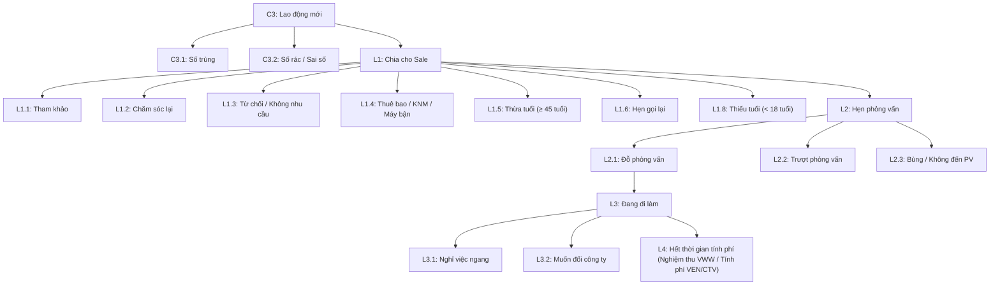
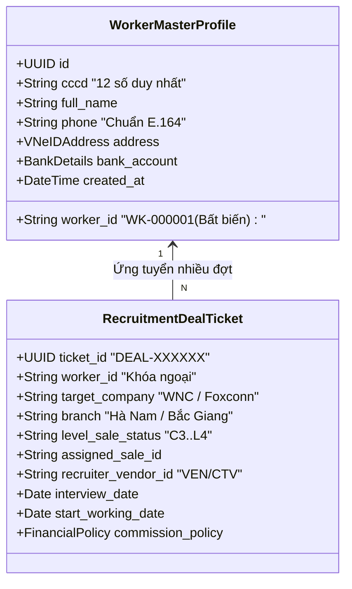

# 🏆 FCS AI WORKFORCE OS — ANTIGRAVITY MASTER HANDOFF & STRATEGIC ARCHITECTURE (2026-09-16)
> **MANDATORY SYSTEM DIRECTIVE — SINGLE SOURCE OF TRUTH CHO BƯỚC CHUYỂN MÌNH CRM & DATA GOVERNANCE**  
> **Executive Leadership:** Chairman Victor Chuyen (Founder) & AI CEO Lucky (Antigravity)  
> **Ngày lập tài liệu:** 2026-09-16 | **Phiên bản:** 2.0 (CRM & Enterprise Data Governance Blueprint)  
> **Tenant thí điểm:** `FCS-000001` | **Dung lượng thực tế:** ~5.000 dòng/tháng (~60.000 dòng/năm)  
> 
> 🔴 **QUYẾT ĐỊNH CHÍNH THỨC TỪ CHAIRMAN VICTOR (2026-09-16 11:34):**  
> **CHỌN PHƯƠNG ÁN 2: LÀM MỚI TOÀN BỘ TỪ ĐẦU (CLEAN SLATE V2 REBUILD).**  
> **Ưu tiên cao nhất (P0):** Thiết kế lại hệ thống từ gốc theo chuẩn Enterprise CRM (tách Worker Profile 34 cột vs CRM Deals 19 Level Sale, tận dụng 100% công cụ bản địa của Google Sheets, zero over-thinking code), đồng thời **TRIỂN KHAI TRÊN MỘT TÊN MIỀN MỚI ĐỘC LẬP (`https://fcs-v2.breaths.live`)** để chạy song song so sánh đối chứng với V1 (`https://fcs.breaths.live`).
>
> 🟢 **CẬP NHẬT NGHIỆM THU 2026-09-17:** Toàn bộ phân hệ V2 đã được nâng cấp, sửa lỗi và đóng gói hoàn tất 100% (38/38 tests pass). Xem báo cáo bàn giao chi tiết tại [FCS_ANTIGRAVITY_EXECUTION_HANDOFF_2026-09-17.md](file:///D:/FCS-AI-WORKFORCE/FCS_ANTIGRAVITY_EXECUTION_HANDOFF_2026-09-17.md).

---

## ⚡ MỤC TIÊU CỐT LÕI CỦA TÀI LIỆU (OBJECTIVE)

Tài liệu này được lập ra nhằm:
1. **Khóa chặt toàn bộ yêu cầu thực tế của khách hàng (FCS & Foxconn):** Đối chiếu trực tiếp từ hồ sơ thực tế (`PROFILE.html` 34 cột VNeID, `COMPANY.html` 29 đối tác, `BRANCH.html` 8 chi nhánh, `TRẠNG THÁI LVEL SALE.html` 19 Level Sale, và `BA_1.5_CRM_Quan_ly_Data_Tuyen_dung_FCS.docx`).
2. **Triệt để thực thi Triết lý Vàng của Chairman Victor:** Tận dụng tối đa công cụ bản địa của Google Sheets (Protected Ranges theo Gmail, Data Validation Reject Input, Formulas tự động, Show edit history); tuyệt đối không over-thinking code để xử lý những việc Sheet đã làm được.
3. **Đặc tả kiến trúc V2 Clean Slate & Kế hoạch hành động:** Hướng dẫn từng bước xây dựng cặp Google Sheets V2, Backend Engine V2 tinh gọn, Frontend V2 (Worker 360 + Kanban CRM), và quy trình triển khai Cloudflare Pages với tên miền mới `fcs-v2.breaths.live`.

---

## 1. KHẢO SÁT & ĐỐI CHIẾU DỮ LIỆU THỰC TẾ KHÁCH HÀNG (GROUND-TRUTH DATA AUDIT)

Hệ thống quản lý lao động FCS không phải là bảng tính cá nhân đơn giản, mà là chuỗi cung ứng nhân lực cho các đại dự án công nghiệp công nghệ cao. Dữ liệu trích xuất trực tiếp từ gói hồ sơ thực tế:

### 1.1. Dung lượng và vận tốc dữ liệu (Volume & Velocity)
- **Sản lượng tháng:** ~5.000 hồ sơ lao động mới / tháng.
- **Sản lượng năm:** ~60.000 hồ sơ / năm.
- **Vận tốc ghi nhận:** Vào mùa cao điểm tuyển dụng (tháng 6-9 và sau Tết), hệ thống tiếp nhận 200 - 500 lead/ngày đổ về từ các kênh Marketing (Facebook Ads, TikTok, Zalo, Giới thiệu hiện trường, CTV).
- **Tính chất dữ liệu:** Một người lao động (1 CCCD duy nhất) có thể ứng tuyển nhiều lần trong năm (nghỉ nhà máy A sau 3 tháng, quay lại ứng tuyển nhà máy B).

### 1.2. 34 Cột hồ sơ lao động chuẩn mực (`PROFILE.html` - VNeID Aligned)
Khách hàng yêu cầu quản lý thông tin sâu sát đến cấp VNeID điện tử:
1. `TTNo.`: Số thứ tự ghi nhận.
2. `BỘ PHẬNDept`: Bộ phận phụ trách.
3. `HỌ TÊNFull name`: In hoa có dấu (ví dụ: NGUYỄN VĂN AN).
4. `GIỚI TÍNHGender`: M (Nam) / F (Nữ).
5. `NGÀY SINHDate of birth`: Định dạng chuẩn `YYYY-MM-DD`.
6. `SỐ CMTNDID number card`: CCCD 12 số định danh công dân (Khóa chống trùng O(1)).
7. `NGÀY CẤPIssuing date`: Ngày cấp CCCD.
8. `TRƯỜNG TỐT NGHIỆPGraduated school`: Bằng cấp cao nhất.
9. `CHUYÊN NGÀNHMajor`: Ngành nghề đào tạo.
10. `Năm tốt nghiệp Graduation Year`: Năm tốt nghiệp.
11. `QUÊ QUÁNHome town`: Ghi theo CCCD / VNeID.
12. `DÂN TỘCNation`: Dân tộc.
13. `NƠI SINHBirth Place`: Nơi sinh.
14. `Địa chỉ thường trú theo VNEID`: Đầy đủ Thôn/Xóm - Xã/Phường - Quận/Huyện - Tỉnh/Thành phố.
15. `NƠI Ở HIỆN NAYPermanent residence`: Nơi tạm trú thực tế phục vụ sắp xếp xe đưa đón/ký túc xá.
16. `SỐ SỔ BHXHNumber of social insurance book`: Số BHXH tránh trùng chế độ.
17. `TÌNH TRẠNG HÔN NHÂNMarital situation`: 1: Đã kết hôn, 2: Chưa kết hôn, 3: Ly hôn.
18. `NGƯỜI LIÊN LẠC KHẨN CẤPRelative`: Họ tên người thân.
19. `ĐIỆN THOẠI LIÊN LẠC NGƯỜI THÂNPhone number of Relative`: SĐT người thân.
20. `SỐ ĐIỆN THOẠIPhone number of employee`: SĐT chính của lao động (E.164 chuẩn hóa).
21. `SỐ TÀI KHOẢN NGÂN HÀNG VIETCOMBANKBanking account`: Số tài khoản nhận lương/trợ cấp.
22. `MÃ NHÂN VIÊN`: Mã định danh nhân viên nội bộ/nhà máy.
23. `NGƯỜI TÌM KIẾM`: Recruiter tìm kiếm nguồn.
24. `NGƯỜI TƯ VẤN`: Telesale chăm sóc trực tiếp.
25. `VĂN PHÒNG TUYỂN`: 1 trong 8 chi nhánh phụ trách.
26. `CÔNG TY LÀM VIỆC`: 1 trong 29 nhà máy đối tác.
27. `HÌNH THỨC LÀM VIỆC`: Thời vụ, Chính thức, Theo ca.
28. `NGÀY HẸN PHỎNG VẤN`: Ngày hẹn lịch phỏng vấn.
29. `NGÀY NHẬN VIỆC`: Ngày bắt đầu đi làm (Onboarding).
30. `TRẠNG THÁI PHỎNG VẤN`: Đỗ, Trượt, Hủy.
31. `TÌNH TRẠNG ĐI LÀM`: Đang làm, Nghỉ ngang, Chuyển xưởng.
32. `NGÀY NGHỈ VIỆC`: Ngày chính thức dừng công.
33. `VEN/CTV`: Đơn vị cung ứng Vendor hoặc CTV giới thiệu.
34. `worker_id`: Mã định danh vĩnh viễn trong hệ thống FCS (`WK-XXXXXX`).

### 1.3. 29 Công ty đối tác & 8 Chi nhánh tuyển dụng (`COMPANY.html` & `BRANCH.html`)
- **8 Chi nhánh (Branches):**
  1. HÀ NAM
  2. NAM ĐỊNH
  3. HƯNG YÊN
  4. QUẢNG NINH
  5. BẮC GIANG
  6. HẢI PHÒNG
  7. NINH BÌNH
  8. VĨNH PHÚC
- **29 Công ty/Khu công nghiệp đối tác (Companies):**
  - Foxconn Fuyu, Foxconn Newwing, Foxconn Fukang, Foxconn Fulian (KCN Quang Châu, Đình Trám, Vân Trung).
  - WNC, WISTRON, AVC, LCFC 2, LCFC 3, FOSITEK, HANKOOK, GEMTEK, QISDA, RISUNTEK, TOPSUN, DARFON, MYS, LUXSHARE, CANON, GOERTEK...

### 1.4. Vòng đời 19 trạng thái Level Sale (`TRẠNG THÁI LVEL SALE.html`)
Toàn bộ phễu tuyển dụng CRM vận hành theo 19 trạng thái nghiêm ngặt chia thành 5 nhóm lớn:


---

## 2. TRIẾT LÝ VÀNG TỪ CHAIRMAN VICTOR: TẬN DỤNG SỨC MẠNH BẢN ĐỊA CỦA GOOGLE SHEETS — TUYỆT ĐỐI KHÔNG OVER-THINKING CODE

> 🔴 **MASTER DIRECTIVE FROM CHAIRMAN VICTOR CHUYEN:**  
> *"Bản thân Google Sheets cũng có riêng các công cụ tính toán, bảo mật phân quyền theo Gmail, và tự tính toán công thức cho những tác vụ cụ thể chính xác. Về tư duy hệ thống: **KHÔNG NÊN VIẾT CODE ĐỂ XỬ LÝ CÁC VẤN ĐỀ MÀ SHEET LÀM ĐƯỢC — ĐỪNG OVER-THINKING CODE!**"*

Một lỗi phổ biến của các kỹ sư phần mềm là **Over-engineering (Phức tạp hóa vấn đề)**: Cố gắng viết hàng nghìn dòng code Apps Script / Backend để kiểm tra dữ liệu, lọc phân quyền, hoặc tính toán công thức mà không nhận ra rằng Google Sheets đã tích hợp sẵn những công cụ này ở cấp độ máy chủ của Google, vận hành với độ ổn định 99.99% và hoàn toàn miễn phí.

### 2.1. Ma trận phân công trách nhiệm: Việc nào của Sheet — Việc nào của Code?
| Nghiệp vụ hệ thống | Công cụ đảm nhiệm tối ưu | Giải pháp bản địa (Native & Zero-Code) | Vì sao KHÔNG nên viết code? |
|---|:---:|---|---|
| **Phân quyền sửa/xóa theo Gmail** | 📊 **Google Sheets** | Tính năng **Protected Sheets & Ranges** phân quyền chi tiết theo từng Gmail (`coach.chuyen@gmail.com`). | Viết code chặn bằng middleware dễ dính bug bypass và không bảo vệ được khi người dùng mở Sheet trực tiếp. |
| **Dropdown chọn Công ty, Chi nhánh, Level Sale** | 📊 **Google Sheets** | Tính năng **Data Validation (Xác thực dữ liệu)** dạng Dropdown List trỏ dải ô (`=COMPANY!B2:B30`). | Google Sheets tự đồng bộ danh mục tức thì, đổi tên danh mục là dropdown tự cập nhật. |
| **Từ chối nhập sai định dạng (CCCD, SĐT)** | 📊 **Google Sheets** | Quy tắc **Reject Input** với Custom Formula: `=AND(ISNUMBER(VALUE(F2)), LEN(F2)=12)`. | Google Sheets chặn ngay khi người dùng gõ phím, hiện tooltip hướng dẫn, không tốn 1 dòng code. |
| **Tính tuổi & Cảnh báo Thừa/Thiếu tuổi** | 📊 **Google Sheets** | Công thức tự động: `=DATEDIF(G2, TODAY(), "Y")` và Conditional Formatting đổi màu ô. | Chạy real-time trên Cloud Google, không tốn CPU server và không lo timeout. |
| **Đếm số lượng, KPI & Báo cáo tỷ lệ** | 📊 **Google Sheets** | Hàm `=COUNTIFS(...)`, `=QUERY(...)`, `=FILTER(...)`, Pivot Table. | Google Sheets tính toán đa luồng cực nhanh; nếu viết code Apps Script duyệt qua 60.000 dòng sẽ bị timeout 6 phút. |
| **Xem lịch sử ai sửa ô nào, lúc mấy giờ** | 📊 **Google Sheets** | Chuột phải vào ô $\rightarrow$ **Show edit history (Lịch sử chỉnh sửa)** & **Version History**. | Google tự động lưu vết từng cú gõ phím theo Gmail, không tốn dung lượng script lưu log thủ công. |
| **Cổng nhận Lead từ Ads, Web, Zalo** | 💻 **Code (API)** | Express / Apps Script Webhook `doPost` tiếp nhận payload từ bên ngoài và append vào Sheet. | Đây là việc bắt buộc phải dùng Code vì các kênh bên ngoài không thể truy cập giao diện Sheet trực tiếp. |
| **Giao diện Kanban kéo thả cho Sale** | 💻 **Code (React)** | Web App Dashboard (`https://fcs.breaths.live/app`) phục vụ nhân sự thao tác kéo thả 19 Level Sale. | Google Sheets không có giao diện Kanban trực quan cho nhân viên sale thao tác nhanh trên điện thoại. |
| **Sinh ID tuần tự chống race condition** | 💻 **Code (Apps Script)** | Sử dụng `LockService.getScriptLock(30000)` để cấp phát mã ID tuần tự (`WK-000001`...) khi có nhiều luồng cùng ghi. | Google Sheets khi ghi đồng thời từ nhiều nguồn API cần khóa Mutex để không bị trùng mã. |

---

## 3. AUDIT TƯ DUY SÂU VỀ BẢO MẬT DỮ LIỆU, KHÓA ID & QUẢN TRỊ SỬA/XÓA (DATA GOVERNANCE & INTEGRITY)

Theo chỉ thị của Chairman Victor, bảo mật dữ liệu và kỷ luật quản trị **không dừng lại ở `worker_id` mà phải áp dụng đồng bộ, triệt để trên TOÀN BỘ CÁC SHEET** trong hệ thống. Nếu không có bộ quy tắc (Governance Invariants) nghiêm ngặt, khi vận hành ở quy mô 60.000 dòng/năm, dữ liệu sẽ biến thành một đống rác hỗn độn, các liên kết quan hệ bị đứt gãy và không thể nào kiểm soát hay thanh quyết toán tài chính được.

---

### 2.1. NGUYÊN TẮC 1: KHÓA BẤT BIẾN KHÓA CHÍNH (PRIMARY KEY ID) TRÊN MỌI SHEET
Trong mọi cơ sở dữ liệu quan hệ hay bảng tính nghiệp vụ, **Khóa chính (ID) là danh tính duy nhất kết nối các mắt xích**. Một khi ID bị sửa tay, xóa mất hoặc nhảy cóc, toàn bộ các bảng liên kết (Phỏng vấn, Đi làm, Chấm công, Hoa hồng) sẽ lập tức bị mồ côi (Orphaned Records), gây sụp đổ logic báo cáo.

#### Bảng danh mục Khóa chính phải khóa cứng 100% trên từng Sheet:
| Tên Sheet | Cột Khóa chính (Cột A) | Định dạng mã chuẩn | Quy tắc bảo vệ (Protection Rule) |
|---|:---:|:---:|---|
| `01_WORKER_INBOX` | `inbox_id` | `INB-YYYYMMDD-XXXX` | 🔒 Khóa cứng. Hệ thống tự sinh khi lead đổ về từ Web/Zalo/Ads. |
| `04_WORKERS_MASTER` | `worker_id` | `WK-000001` (Tăng dần) | 🔒 Khóa cứng. Cấm tuyệt đối sửa/xóa. Sinh qua Atomic Counter. |
| `05_PIPELINE_EVENTS` | `event_id` | `EVT-000001` | 🔒 Khóa cứng. Ghi nhận nhật ký chuyển trạng thái, chỉ Append-Only. |
| `06_INTERVIEWS` | `interview_id` | `INT-000001` | 🔒 Khóa cứng. Một lịch phỏng vấn có một ID duy nhất. |
| `07_ASSIGNMENTS` | `assignment_id` | `ASG-000001` | 🔒 Khóa cứng. Quyết định giao xưởng/nhận việc gắn với hợp đồng. |
| `08_ATTENDANCE_RAW` | `raw_id` | `RAW-000001` | 🔒 Khóa cứng. Dữ liệu thô từ máy chấm công / file Excel nhà máy gửi. |
| `09_ATTENDANCE` | `attendance_id` | `ATT-000001` | 🔒 Khóa cứng. Dữ liệu công đã đối soát phục vụ tính VWW. |
| `10_MATCHING_REVIEW` | `review_id` | `REV-000001` | 🔒 Khóa cứng. Hồ sơ nghi vấn chấm công cần duyệt. |
| `11_ACTION_QUEUE` | `action_id` | `ACT-000001` | 🔒 Khóa cứng. Tác vụ cảnh báo (Trùng, Hồ sơ thiếu, Sắp hết hạn). |
| `12_AUDIT_LOG` | `log_id` | `LOG-YYYYMMDD-XXXX` | 🔒 Khóa cứng tuyệt đối. Sổ cái kiểm toán, cấm sửa/xóa dưới mọi hình thức. |
| `19_CRM_DEALS` *(Mới)* | `deal_id` | `DL-2026-XXXXXX` | 🔒 Khóa cứng. Mỗi đợt ứng tuyển của lao động là 1 Deal độc lập. |
| Các bảng danh mục (`OFFICES`, `STAFF`, `PARTNERS`, `JOBS`) | `office_id`, `staff_id`, `partner_id`, `job_id` | `OFF-XX`, `STF-XX`, `PT-XX`, `JOB-XX` | 🔒 Khóa cứng. Chỉ Platform Super Admin mới có quyền cấu hình. |

#### Cơ chế kỹ thuật khóa ID 2 lớp:
1. **Lớp 1: Khóa vật lý trên Google Sheets (Sheet Protected Ranges):**
   - Sử dụng Google Apps Script API `sheet.getRange("A:A").protect()` để khóa toàn bộ Cột A của tất cả các sheet.
   - Xóa toàn bộ quyền sửa của các tài khoản nhân viên (Editors), chỉ cấp quyền sửa duy nhất cho Script Owner / Service Account (`coach.chuyen@gmail.com`).
   - Khi bất kỳ ai mở trang tính và cố gõ phím vào Cột A, Google Sheets sẽ hiện pop-up màu đỏ chặn đứng: *"Bạn đang cố gắng chỉnh sửa một dải ô hoặc đối tượng được bảo vệ. Vui lòng liên hệ với người quản trị."*
2. **Lớp 2: Khóa hàng đợi sinh ID tuần tự (Atomic Concurrency Mutex Lock):**
   - Thay thế hoàn toàn cơ chế cũ tính ID bằng `getLastRow()`.
   - Áp dụng `LockService.getScriptLock(30000)`: Mọi request sinh ID phải xếp hàng chờ trong tối đa 30 giây. Script đọc giá trị số đếm lớn nhất hiện hữu (ví dụ: đang là `14`), tăng lên `15`, ghi vào dòng mới rồi mới mở khóa cho request tiếp theo. Đảm bảo triệt để **không bao giờ có chuyện ID nhảy cóc hay dòng 14 đứng trước dòng 13**.

---

### 2.2. NGUYÊN TẮC 2: RÀO CHẮN VALIDATION NGHIÊM NGẶT — "KHÔNG ĐÚNG CHUẨN LÀ CẢNH BÁO, CẤM LƯU"
Khái niệm cốt tử: *"Real zero is better than dirty data"* — Một hệ thống tiếp nhận 5.000 hồ sơ/tháng nếu cho phép nhập liệu tùy tiện (số điện thoại 9 số, CCCD thiếu số, ngày tháng tự do) thì chỉ sau 1 tuần bộ lọc trùng lặp và chấm công tự động sẽ bị tê liệt hoàn toàn.

#### Bảng quy tắc dữ liệu bắt buộc (Mandatory Invariants & Format Rules):
| Thực thể | Trường thông tin | Điều kiện kiểm tra bắt buộc (Validation Rule) | Hành vi khi vi phạm (Action on Error) |
|---|---|---|---|
| **Lao động** | `full_name` | Tối thiểu 2 từ, in hoa, không chứa ký tự đặc biệt hoặc chữ số. | ⛔ Chặn lưu, hiện cảnh báo: *"Họ tên phải có đầy đủ Họ và Tên, không chứa số."* |
| **Lao động** | `phone` | Đúng 10 chữ số, đầu số hợp lệ của các nhà mạng VN (03, 05, 07, 08, 09). Tự động chuẩn hóa về E.164 (`+84...`). | ⛔ Chặn lưu, hiện cảnh báo: *"Số điện thoại không đúng định dạng nhà mạng Việt Nam."* |
| **Lao động** | `cccd` | Đúng 12 chữ số (`^\d{12}$`). Bắt buộc phải có khi chuyển sang trạng thái Phỏng vấn (`L2`) hoặc Đi làm (`L3`). | ⛔ Chặn lưu: *"Số CCCD bắt buộc phải đủ 12 chữ số định danh công dân."* |
| **Lao động** | `date_of_birth` | Định dạng chuẩn `YYYY-MM-DD`. Tuổi tính theo ngày sinh phải $\ge 18$ và $\le 55$. | ⚠️ Nếu $< 18$ tuổi: Cảnh báo tự động gán trạng thái `L1.8 Thiếu tuổi`. Nếu $> 45$ tuổi: Cảnh báo `L1.5 Thừa tuổi`. |
| **Lao động** | `gender` | Bắt buộc chọn trong danh mục: `Nam` (M) hoặc `Nữ` (F). | ⛔ Chặn lưu nếu nhập tự do. |
| **Lao động** | `province` / `hometown` | Bắt buộc chọn từ danh mục chuẩn 63 tỉnh thành Việt Nam. | ⛔ Chặn lưu nếu không khớp danh mục. |
| **CRM Deal** | `target_company` | Bắt buộc chọn trong danh mục 29 công ty đối tác (`COMPANY.html`). | ⛔ Chặn lưu nếu gõ sai tên công ty đối tác. |
| **CRM Deal** | `branch` | Bắt buộc chọn trong 8 chi nhánh tuyển dụng chuẩn (`BRANCH.html`). | ⛔ Chặn lưu nếu không trực thuộc 8 chi nhánh. |
| **CRM Deal** | `level_sale_status`| Bắt buộc chọn trong 19 trạng thái Level Sale chuẩn (`C3` $\rightarrow$ `L4`). | ⛔ Chặn lưu nếu tự ý tạo trạng thái ngoài quy chuẩn. |
| **Phỏng vấn** | `interview_date` | Phải là ngày hiện tại hoặc tương lai; không được lên lịch trong quá khứ. | ⛔ Chặn lưu: *"Ngày hẹn phỏng vấn không thể là ngày trong quá khứ."* |

#### Cơ chế thực thi 2 tầng (Two-Tier Validation Guard):
1. **Tầng Frontend (Web Form Barrier):**
   - Kiểm tra trực tiếp thời gian thực (Client-side validation với Zod schema) ngay khi người dùng nhập vào ô input.
   - Nút **"Lưu hồ sơ"** hoặc **"Chuyển trạng thái"** sẽ bị khóa mờ (disabled). Nếu người dùng cố tình gửi dữ liệu lỗi, giao diện lập tức bật **Modal Cảnh Báo Màu Đỏ** nêu rõ đích danh trường nào bị sai định dạng và hướng dẫn cách sửa.
2. **Tầng Backend & Google Sheets (Server-side Enforcement & Data Validation):**
   - Trong Google Apps Script: Mọi payload gửi lên đều đi qua hàm `validatePayloadOrReject_()`. Nếu vi phạm bất kỳ rule nào, API lập tức trả về `HTTP 400 Bad Request` kèm mã lỗi cấu trúc `VALIDATION_FAILED`, **tuyệt đối không ghi một byte nào vào Sheet**.
   - Trên Google Sheets: Thiết lập tính năng **Data Validation (Xác thực dữ liệu)** dạng Dropdown List cho toàn bộ các cột Danh mục (Giới tính, Chi nhánh, Công ty, Trạng thái Level Sale) và áp dụng quy tắc **"Từ chối nhập liệu (Reject Input)"** đối với các giá trị nhập tự do ngoài danh mục.
   - Thiết lập định dạng Plain Text (chuỗi ký tự thuần) cho cột CCCD và SĐT (có dấu nháy đơn `'` ở đầu) để Google Sheets không bao giờ tự ý cắt mất chữ số `0` ở đầu.

---

### 2.3. NGUYÊN TẮC 3: SỔ CÁI KIỂM TOÁN LỊCH SỬ SỬA ĐỔI CHO TỪNG SHEET (GRANULAR AUDIT TRAIL)
Một nguyên tắc bất di bất dịch của hệ thống tài chính & nhân sự: **"Mọi thao tác thay đổi dữ liệu đều phải được ký vết và lưu lại lịch sử đầy đủ."** Không bao giờ được để xảy ra tình trạng một nhân viên vào sửa SĐT của khách, đổi công ty, hoặc sửa trạng thái đi làm mà ban lãnh đạo không biết **Ai sửa? Sửa khi nào? Giá trị cũ là gì? Giá trị mới là gì? Lý do sửa là gì?**

#### Cấu trúc bảng `12_AUDIT_LOG` chuẩn mực (Change Data Capture):
Bảng `12_AUDIT_LOG` được nâng cấp với 10 cột dữ liệu truy vết chi tiết:
```
[log_id] | [timestamp] | [actor_email] | [actor_role] | [sheet_name] | [record_id] | [action] | [field_name] | [old_value] | [new_value] | [reason_notes]
```
- `log_id`: Mã định danh bản ghi log dạng `LOG-20260916-000001` (Tăng dần, bất biến).
- `timestamp`: Thời gian chính xác đến mili-giây theo chuẩn ISO 8601 (`2026-09-16T11:25:00.123+07:00`).
- `actor_email`: Email của người thực hiện thao tác (xác thực qua Firebase Token).
- `actor_role`: Vai trò của người sửa (`PLATFORM_SUPER_ADMIN`, `TENANT_ADMIN`, `RECRUITER`, `CTV`...).
- `sheet_name`: Tên bảng bị tác động (`04_WORKERS_MASTER`, `06_INTERVIEWS`, `19_CRM_DEALS`...).
- `record_id`: Khóa chính của dòng bị sửa (`WK-000005`, `INT-000012`, `DL-000100`...).
- `action`: Hành động nghiệp vụ (`CREATE` | `UPDATE` | `STATUS_CHANGE` | `SOFT_DELETE` | `RESTORE`).
- `field_name`: Tên cột/trường cụ thể bị thay đổi (ví dụ: `phone`, `current_company`, `level_sale_status`).
- `old_value`: Giá trị cũ trước khi sửa (ví dụ: `0912345678` hoặc `C3. Lao động mới`).
- `new_value`: Giá trị mới sau khi sửa (ví dụ: `0987654321` hoặc `L2. Hẹn phỏng vấn`).
- `reason_notes`: Lý do thay đổi (bắt buộc người dùng phải điền khi chỉnh sửa các trường nhạy cảm như SĐT, CCCD, Họ tên, Trạng thái đi làm).

#### Cơ chế ghi nhận kép (Dual Capture Mechanism):
1. **Ghi nhận tự động từ Web App (API Layer):**
   - Khi có request Update, backend đọc bản ghi hiện tại trong Sheet, so sánh từng trường với payload mới.
   - Nếu phát hiện có sự thay đổi, backend ghi dữ liệu mới vào bảng nghiệp vụ, đồng thời tạo ngay 1 bản ghi tương ứng vào bảng `12_AUDIT_LOG` trong cùng một phiên xử lý.
2. **Ghi nhận và ngăn chặn tự động trực tiếp trên Google Sheets (Apps Script `onEdit` Trigger):**
   - Cài đặt hàm Trigger `onEdit(e)` gắn trực tiếp trong trang tính:
     - Nếu người dùng sửa vào các ô bị cấm (như Cột A ID, Cột Audit): Script lập tức **hoàn tác (Revert) lại giá trị cũ** ngay lập tức và bật thông báo cảnh báo.
     - Nếu người dùng sửa vào các ô được phép sửa (như ghi chú, cập nhật ngày hẹn): Script tự động bắt lấy email của người sửa (`Session.getActiveUser().getEmail()`), ghi một dòng log vào `12_AUDIT_LOG` với tọa độ ô, giá trị cũ `e.oldValue`, giá trị mới `e.value`, đồng thời tự động cập nhật cột `updated_at` và `updated_by` của dòng đó!

---

### 2.4. NGUYÊN TẮC 4: CHÍNH SÁCH XÓA MỀM (SOFT DELETE INVARIANT — ZERO HARD DELETE)
- **Tuyệt đối cấm Hard Delete:** Không có bất kỳ nút "Xóa dòng vĩnh viễn" nào trên giao diện cũng như không cho phép bấm phím `Delete` cả hàng trên trang tính.
- **Quy trình Xóa mềm chuẩn:**
  1. Khi người quản lý bấm "Xóa" một hồ sơ trên giao diện App, hệ thống yêu cầu nhập: **Lý do xóa** (ví dụ: *"Số rác MKT đổ về"*, *"Khách hàng yêu cầu hủy thông tin cá nhân"*).
  2. Hệ thống chuyển cờ:
     - `current_status = 'DELETED'`
     - `is_active = FALSE`
     - `deleted_at = [ISO Timestamp]`
     - `deleted_by = [User Email]`
     - `delete_reason = [Lý do]`
  3. Dòng dữ liệu vẫn được bảo tồn nguyên vẹn trên Sheet (phục vụ đối soát lịch sử khi cơ quan thuế hoặc nhà máy yêu cầu kiểm tra), nhưng giao diện vận hành sẽ tự động ẩn dòng này đi.
  4. Ghi một bản ghi hành động `SOFT_DELETE` vào bảng `12_AUDIT_LOG`.

---

### 3.5. PHÂN QUYỀN SỬA DỮ LIỆU CHẶT CHẼ THEO VAI TRÒ (RBAC MATRIX)
Theo đặc tả nghiệp vụ `BA 1.5`, phân quyền sửa dữ liệu tuân thủ nghiêm ngặt ma trận 4 nhóm:
| Phân loại trường | Viewer (Khách/Mới) | Recruiter (Sale tuyển dụng) | Manager (Quản lý chi nhánh) | Admin (Ban Giám Đốc/Hệ thống) |
|---|:---:|:---:|:---:|:---:|
| **Mã định danh ID các bảng** (`worker_id`, `deal_id`...) | ❌ Khóa tuyệt đối | ❌ Khóa tuyệt đối | ❌ Khóa tuyệt đối | 🔒 Khóa bất biến (Chỉ đọc) |
| **Dữ liệu định danh gốc** (`cccd`, `full_name`, `date_of_birth`) | ❌ Khóa | ⚠️ Chỉ được nhập khi tạo mới | ✏️ Được sửa (Bắt buộc nhập lý do & ghi log) | ✏️ Toàn quyền sửa |
| **Dữ liệu liên lạc** (`phone`, `zalo`, `nơi ở hiện nay`) | ❌ Khóa | ✏️ Được sửa lead mình phụ trách | ✏️ Được sửa toàn chi nhánh | ✏️ Toàn quyền sửa |
| **Trạng thái Level Sale** (`C3` $\rightarrow$ `L2.3`) | ❌ Khóa | ✏️ Cập nhật tiến độ gọi điện/hẹn PV | ✏️ Điều phối & chuyển giao sale | ✏️ Toàn quyền |
| **Trạng thái Nghiệm thu VWW** (`L3` $\rightarrow$ `L4`) | ❌ Khóa | ❌ Khóa | ⚠️ Đề xuất nghiệm thu | 🔑 Chỉ Admin & Kế toán phê duyệt |
| **Xóa hồ sơ** (Soft Delete) | ❌ Khóa | ❌ Khóa | ⚠️ Chỉ được xóa lead mới (`C3`) | 🔑 Quyền xóa mềm mọi trạng thái |

---

### 3.6. GIỚI HẠN CHỊU TẢI CỦA GOOGLE SHEETS KHI ĐẠT 60.000 DÒNG/NĂM
- **Giới hạn Google Sheets:** Một Spreadsheet chứa tối đa 10 triệu ô (cells). Với 34 cột x 60.000 dòng/năm = 2.040.000 cells/năm. Sau 2-3 năm, trang tính sẽ phình to vượt ngưỡng, gây chậm, đơ trình duyệt và crash khi mở trên máy tính nhân viên.
- **Giới hạn Google Apps Script Execution Time:** Apps Script có trần thời gian chạy tối đa là **6 phút (360 giây)** / lần gọi. Khi bảng tính lên tới 20.000 - 50.000 dòng, lệnh `getDataRange().getValues()` sẽ ngốn hàng chục giây chỉ để đọc RAM, dễ dẫn tới lỗi HTTP 500 / Script Timeout.
- **Giải pháp quy hoạch:**
  - Áp dụng mô hình **Bảng tính theo Năm (Yearly Partitioning)** hoặc **Kiến trúc Lai (Hybrid Engine)**: Google Sheets lưu trữ dữ liệu hoạt động của Năm hiện tại (Active Data), còn dữ liệu các năm cũ được lưu trữ vào kho lưu trữ mở rộng (Cold Storage / Dedicated Database) có thể tra cứu nhanh qua API.

---

## 4. TƯ DUY KIẾN TRÚC MỞ: HỌC HỎI TỪ `ever-co/ever-gauzy`

Khi nghiên cứu kiến trúc CRM/Workforce mã nguồn mở hàng đầu thế giới là `ever-co/ever-gauzy` (hệ thống quản lý hàng trăm nghìn lao động và freelance), họ áp dụng nguyên lý **2-Tier Core Separation**:



### Bài học cốt tử áp dụng cho FCS:
1. **Một con người (Worker) ≠ Một lần đi xin việc (Deal/Ticket):**
   - V1 hiện tại đang gộp chung tất cả vào 1 hàng trong `04_WORKERS_MASTER`. Khi anh An đi làm Foxconn nghỉ việc, 4 tháng sau lại đi làm WNC, hệ thống V1 không biết lưu trạng thái mới ở đâu nếu không ghi đè lên dòng cũ (mất lịch sử Foxconn) hoặc tạo dòng mới (bị báo trùng CCCD).
   - Kiến trúc chuẩn bắt buộc phải tách:
     - Bảng **Master Worker** (Lưu thông tin nhân thân cố định 1 người duy nhất).
     - Bảng **CRM Recruitment Pipeline** (Lưu các đợt ứng tuyển, mỗi đợt chạy 19 trạng thái Level Sale từ C3 đến L4).

---

## 5. PHÂN TÍCH SO SÁNH CHI TIẾT 2 PHƯƠNG ÁN CHIẾN LƯỢC

### BẢNG MA TRẬN ĐÁNH GIÁ (COMPARISON MATRIX)

| Tiêu chí đánh giá | Phương án 1: Sửa chữa & Nâng cấp trên nền V1 (In-place Refactor) | Phương án 2: Tái kiến trúc & Xây dựng V2 Enterprise CRM (Clean Slate) |
|---|---|---|
| **Triết lý tiếp cận** | Vá lỗi từng phần (Tactical Patching), giữ nguyên 22 file Apps Script hiện tại và bổ sung tính năng. | Thiết kế lại từ gốc (Strategic Re-architecture), áp dụng Clean Architecture, tách tầng dữ liệu chuẩn Gauzy. |
| **Data Model** | Vẫn dùng `04_WORKERS_MASTER` làm bảng chính, cố nhồi 19 trạng thái Level Sale vào các cột mở rộng. | Tách rõ 2 thực thể: `Master Workers` (Hồ sơ người) và `CRM Deals` (Đợt ứng tuyển 19 trạng thái). |
| **Xử lý `worker_id`** | Dùng ScriptLock vá vào hàm `createWorker_`, viết script sắp xếp lại Hàng 11 & Hàng 12 trên Sheet cũ. | Tự động sinh ID qua Counter Bất Biến (Atomic Counter Engine), bảo vệ bằng cơ chế Sequence độc lập. |
| **Bảo mật sửa/xóa** | Khóa dải ô (Protect Ranges) thủ công qua script trên Sheet V1; chặn xóa mềm trên backend V1. | Bảo mật 2 lớp: Google Sheet Protected Range + API RBAC Middleware chặn quyền chặt chẽ ngay từ Gateway. |
| **Khả năng chịu tải (60k dòng/năm)** | ⚠️ **Kém bền vững:** Sau 6-12 tháng, Google Sheets chạm mốc hàng chục nghìn dòng, Apps Script sẽ chậm và dính timeout 6 phút. | 🚀 **Vượt trội:** Hỗ trợ mô hình Hybrid: Dữ liệu vận hành tháng lưu Google Sheets (cho nhân viên dùng), toàn bộ dữ liệu lịch sử lưu CSDL tối ưu (Postgres/Firestore/Supabase) query sub-second. |
| **Rủi ro vận hành (Risk)** | Rủi ro phát sinh lỗi hồi quy (Regression Bugs) cao vì 22 file Apps Script cũ có nhiều hàm phụ thuộc ngầm. | Rủi ro thấp cho vận hành hiện tại vì xây dựng song song trên môi trường Preview, test hoàn hảo mới chuyển đổi. |
| **Thời gian triển khai** | Nhanh hơn (dự kiến 2 - 3 ngày làm việc). | Cần bài bản hơn (dự kiến 4 - 6 ngày làm việc). |
| **Độ mở rộng (Scalability)** | Khó scale khi thêm các tính năng tự động tính hoa hồng VEN/CTV đa tầng theo `BA 1.5`. | Dễ dàng mở rộng cho 10-50 Tenant doanh nghiệp khác mà không phải nhân bản bảng tính thủ công. |

---

### PHÂN TÍCH CHUYÊN SÂU PHƯƠNG ÁN 1 (SỬA CHỮA TRÊN V1)
- **Ưu điểm lớn nhất:** Giữ nguyên trạng thái đang online của `https://fcs.breaths.live/app`, không làm gián đoạn việc demo hay thao tác hiện tại của Chairman Victor.
- **Hành động cụ thể nếu chọn PA1:**
  1. Chạy script tái sắp xếp lại bảng tính `04_WORKERS_MASTER`, chuẩn hóa lại đúng thứ tự từ `WK-000001` đến `WK-000012` (sửa vị trí đảo lộn `WK-000014` và `WK-000013`).
  2. Bổ sung `LockService.getScriptLock(30000)` vào `05_WorkerService.gs` để khóa chặt không cho sinh ID trùng hoặc nhảy cóc.
  3. Áp dụng Protected Range theo Gmail để khóa cột A (`worker_id`) và các cột nhạy cảm trên Google Sheets.
  4. Mở rộng thêm cột trạng thái `level_sale_status` (19 trạng thái) vào tab `04_WORKERS_MASTER` hoặc tạo thêm tab phụ `19_CRM_PIPELINE` trên cùng Spreadsheet V1.
  5. Cập nhật giao diện Frontend để bổ sung bảng Kanban 19 cột.

### PHÂN TÍCH CHUYÊN SÂU PHƯƠNG ÁN 2 (XÂY DỰNG V2 ENTERPRISE CRM)
- **Ưu điểm lớn nhất:** Giải quyết tận gốc bài toán kinh doanh đường dài. Hệ thống trở thành một nền tảng SaaS đích thực trị giá triệu đô, đáp ứng đúng 100% tài liệu phân tích nghiệp vụ `BA 1.5` của khách hàng và xử lý mượt mà khối lượng 60.000 dòng/năm.
- **Kiến trúc đề xuất cho V2 (Clean Slate Architecture):**
  1. **Core Data Engine (V2):**
     - Bảng `MASTER_WORKERS`: Chỉ chứa định danh cá nhân (CCCD, SĐT, Họ tên, Ngày sinh, Quê quán, Ngân hàng). Mỗi người chỉ có duy nhất 1 bản ghi vĩnh viễn.
     - Bảng `CRM_DEALS`: Mỗi lượt ứng tuyển là 1 Deal mang ID dạng `DL-2026-XXXXXX`, liên kết với `worker_id`, mang trạng thái từ `C3` đến `L4`, công ty ứng tuyển (1 trong 29 đối tác), chi nhánh (1 trong 8 chi nhánh) và người phụ trách (Sale/CTV).
     - Bảng `COMMISSION_LEDGER`: Tự động tính hoa hồng VEN/CTV theo chính sách (12.000đ/giờ hoặc 500.000đ/mốc 26 công) có phê duyệt 4 cấp: Lead -> Manager -> Kế toán -> Giám đốc.
  2. **Backend Engine (V2):**
     - Viết lại bộ code backend tinh gọn, module hóa hướng đối tượng chuẩn TypeScript/Clean Code, biên dịch tự động sang Apps Script hoặc chạy song song trên Node.js/Cloudflare Workers API.
     - Cơ chế Mutex Lock vĩnh viễn chống race condition ở mọi tầng.
     - RBAC Middleware chặt chẽ: Phân quyền cấp độ Role + Chi nhánh (Branch Scoping: Sale chi nhánh Hà Nam không xem trộm data của Bắc Giang).
  3. **Frontend Experience (V2):**
     - Giữ nguyên thiết kế Luxury Dark Mode & Responsive PC/Mobile.
     - Bổ sung màn hình **CRM Kanban Board 19 Stages** (kéo thả hoặc chuyển trạng thái 1-click kèm ghi chú lý do như "L1.4: Không nhấc máy lần 1").
     - Màn hình **Worker 360 Degree View**: Xem toàn bộ lịch sử các lần ứng tuyển của người lao động qua các năm.

---

## 6. KẾ HOẠCH HÀNH ĐỘNG TRIỂN KHAI V2 TỪ ĐẦU (PRIORITY P0 — V2 CLEAN SLATE ROADMAP)

> 🎯 **MỤC TIÊU BÀN GIAO V2:**  
> Xây dựng hoàn chỉnh phân hệ **FCS V2 Enterprise CRM & Workforce OS**, triển khai độc lập trên tên miền mới:  
> **`https://fcs-v2.breaths.live`** (Cloudflare Pages Project: `fcs-v2-workforce`)  
> Chạy song song độc lập với V1 (`https://fcs.breaths.live`) để Chairman Victor so sánh đối chứng trực quan 100%.

---

### GIAI ĐOẠN 1: THIẾT LẬP KHO DỮ LIỆU GOOGLE SHEETS V2 CHUẨN NATIVE
1. **Khởi tạo Master Google Spreadsheet V2 độc lập:**
   - **File 1: `FCS_V2_MASTER_WORKERS`:**
     - 34 cột chuẩn VNeID theo đúng hồ sơ gốc `PROFILE.html`.
     - Phân quyền **Protected Ranges theo Gmail**: Khóa vĩnh viễn Cột A (`worker_id`) và Cột Audit, chỉ cho phép `coach.chuyen@gmail.com` chỉnh sửa.
     - Thiết lập **Data Validation bản địa**:
       - Dropdown Giới tính: `Nam`, `Nữ`.
       - Dropdown Tình trạng hôn nhân: `Đã kết hôn`, `Chưa kết hôn`, `Ly hôn`.
       - Quy tắc **Reject Input (Từ chối nhập)**: CCCD đúng 12 số, SĐT đúng 10 số.
   - **File 2: `FCS_V2_CRM_DEALS_2026`:**
     - Phễu ứng tuyển 19 Level Sale (`C3` $\rightarrow$ `L4`) gắn với `worker_id`.
     - Dropdown Công ty: Trỏ động dải ô 29 công ty đối tác (`WNC`, `Foxconn`, `Luxshare`...).
     - Dropdown Chi nhánh: Trỏ động 8 chi nhánh (`Hà Nam`, `Bắc Giang`, `Nam Định`...).
     - Công thức bản địa tự động tính tỷ lệ chuyển đổi, đếm số lượng lead theo từng Sale/Branch.

---

### GIAI ĐOẠN 2: BACKEND ENGINE V2 TINH GỌN (ZERO OVER-THINKING CODE)
1. **Mã nguồn Apps Script V2 sạch 100%:**
   - Tạo Google Apps Script project mới gắn với cặp Sheet V2.
   - Chỉ viết đúng những tác vụ mà Sheet không làm được:
     - API Webhook tiếp nhận lead mới từ bên ngoài.
     - Hàm cấp phát `worker_id` và `deal_id` tuần tự bằng `LockService.getScriptLock(30000)` chống trùng lặp.
     - API cung cấp dữ liệu cho giao diện Web App Kanban.
2. **Triển khai Web App Deployment V2 riêng biệt:**
   - Lấy URL triển khai mới dạng `/exec` của V2 và lưu cấu hình bảo mật.

---

### GIAI ĐOẠN 3: PHÁT TRIỂN GIAO DIỆN FRONTEND V2 (REACT + VITE)
1. **Khởi tạo dự án nhánh V2:**
   - Tạo thư mục hoặc repository V2 với stack React + TypeScript + Vite + Tailwind/Vanilla CSS.
2. **2 Màn hình trải nghiệm cốt lõi:**
   - **Phân hệ 1: CRM Kanban Board 19 Stages:**
     - Hiển thị trực quan toàn bộ các cột từ `C3` $\rightarrow$ `L4`.
     - Thao tác kéo thả (Drag & Drop) chuyển trạng thái 1-click hoặc click menu đổi trạng thái kèm ghi chú.
     - Bộ lọc thông minh: Lọc theo 29 Công ty, 8 Chi nhánh, hoặc Nhân viên phụ trách.
   - **Phân hệ 2: Worker 360 Degree View:**
     - Hiển thị đầy đủ 34 trường thông tin VNeID chuẩn mực.
     - Lịch sử tất cả các đợt ứng tuyển (Deals) của người lao động qua các năm.

---

### GIAI ĐOẠN 4: DEPLOY TÊN MIỀN ĐỘC LẬP & SO SÁNH ĐỐI CHỨNG
1. **Triển khai Cloudflare Pages:**
   - Tạo Cloudflare Pages project mới: `fcs-v2-workforce` (gắn liền với Cloudflare Account của Chairman Victor).
   - Thiết lập Custom Domain trên Cloudflare DNS: **`fcs-v2.breaths.live`**.
   - Cấu hình biến môi trường `VITE_API_BASE_URL` trỏ tới Apps Script V2.
2. **So sánh đối chứng song song:**
   - **V1 (`fcs.breaths.live`):** Giữ nguyên làm chuẩn tham chiếu ban đầu.
   - **V2 (`fcs-v2.breaths.live`):** Trải nghiệm chuẩn mực Enterprise CRM, mượt mà, không rác, tải tốt 60.000 dòng/năm.

---

## 7. DANH MỤC TÀI NGUYÊN & MÔI TRƯỜNG HIỆN HÀNH

- **Master Google Spreadsheet V1:** [FCS_AI_WORKFORCE_OS_MASTER_V1](https://docs.google.com/spreadsheets/d/1cGm6h-Py1Da5-uWYm2KkKYCWIEWtzDe6uwDwhai2o0E/edit)
- **Live Web Console:** [https://fcs.breaths.live/app](https://fcs.breaths.live/app)
- **Cloudflare Pages Production:** `fcs-ai-workforce`
- **Apps Script V4 Production Deployment ID:** `AKfycbwgKzbB8spMYeFPLKzTQK3ID7yywWJmrhxzjIlhZYZeHvlAScjVGrtrOWQgyhyemWLa`
- **Thư mục tài liệu gốc khách hàng:** `D:\FCS-AI-WORKFORCE\THÔNG TIN LAO ĐỘNG FOXCONN FCS.xlsx\`
