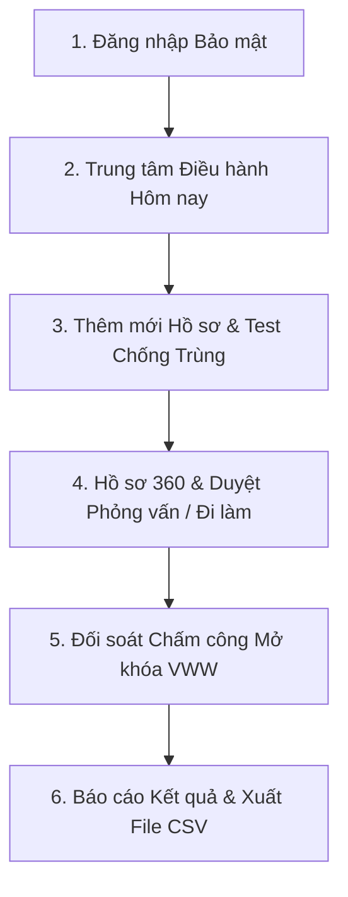

# 🏆 HƯỚNG DẪN TRẢI NGHIỆM & SỬ DỤNG FCS AI WORKFORCE OS
> **Dành riêng cho Khách hàng & Đối tác Doanh nghiệp Cung ứng Lao động**  
> **Executive Leadership:** Chairman Victor Chuyen & AI CEO Lucky  
> **Địa chỉ truy cập Live:** [https://fcs.breaths.live](https://fcs.breaths.live) *(hoặc `http://localhost:3000` khi chạy máy chủ nội bộ)*  
> **Cập nhật:** Tháng 09/2026 — Phiên bản 4.0.0 Production Golive

---

## 🎯 1. TÔN CHỈ HỆ THỐNG — THƯỚC ĐO VWW
Hệ thống **FCS AI WORKFORCE OS** được sinh ra để giải quyết triệt để vấn đề phân mảnh dữ liệu của các doanh nghiệp cung ứng nhân lực:
- **Nói không với dữ liệu ảo (Real Data First):** Mọi hồ sơ, lượt chấm công và số liệu doanh thu đều kết nối trực tiếp hai chiều với Google Sheets thực tế của doanh nghiệp.
- **Thước đo tối thượng — VWW (Verified Working Worker):** Lao động chỉ được công nhận tạo ra doanh thu khi:
  $$\text{Worker ID} + \text{Phân xưởng Đang làm (STARTED)} + \text{Chấm công nhà máy khớp} = \mathbf{VWW}$$

---

## 🔑 2. THÔNG TIN 3 TÀI KHOẢN TRẢI NGHIỆM GOLIVE

Tất cả 3 tài khoản đều sử dụng **Mật khẩu chuẩn doanh nghiệp:**  
👉 `Fcs@2026!` *(viết hoa chữ F, có @ và !)*

| STT | Tài khoản Email | Vai trò (Role) | Chức danh hiển thị | Trách nhiệm cốt lõi |
|:---:|---|---|---|---|
| **1** | `ceo-fcs@breaths.live` | **TENANT_ADMIN** | **Giám đốc Điều hành (CEO)** | Toàn quyền kiểm soát doanh nghiệp, xem phễu Pipeline, doanh thu, kết quả VWW và xuất báo cáo đối tác. |
| **2** | `manager-fcs@breaths.live` | **TENANT_MANAGER** | **Trưởng phòng Vận hành** | Điều phối tuyển dụng, duyệt kết quả phỏng vấn, phân xưởng đi làm, đối soát lệch chấm công. |
| **3** | `staff-fcs@breaths.live` | **RECRUITER** | **Chuyên viên Tuyển dụng** | Tiếp nhận ứng viên mới, nhập liệu hồ sơ nhanh, kiểm tra trùng lặp SĐT/CCCD, lên lịch phỏng vấn. |

> [!IMPORTANT]
> **Quy chuẩn Bảo mật Doanh nghiệp (Enterprise Security):**  
> Để bảo vệ dữ liệu nhân lực và thông tin lương thưởng của doanh nghiệp, hệ thống **bắt buộc xác thực danh tính qua Firebase**.  
> Khách hàng chỉ cần bấm chọn vai trò tương ứng để nạp nhanh Email, sau đó nhập mật khẩu:  
> 👉 **`Fcs@2026!`** rồi bấm **"ĐĂNG NHẬP BẢO MẬT"**.

---

## 🚀 3. HÀNH TRÌNH TRẢI NGHIỆM 5 PHÚT (THE 5-MINUTE TOUR)

### 📍 BƯỚC 1: ĐĂNG NHẬP VÀO HỆ THỐNG
1. Mở trình duyệt truy cập: [https://fcs.breaths.live/login](https://fcs.breaths.live/login) *(hoặc [https://fcs-ai-workforce.pages.dev/login](https://fcs-ai-workforce.pages.dev/login))*.
2. Bấm chọn 1 trong 3 vai trò ở danh sách **"Tài khoản Doanh nghiệp Trải nghiệm"**:
   - `Giám đốc Điều hành (CEO)`: `ceo-fcs@breaths.live`
   - `Trưởng phòng Vận hành`: `manager-fcs@breaths.live`
   - `Chuyên viên Tuyển dụng`: `staff-fcs@breaths.live`
3. Nhập mật khẩu chuẩn: `Fcs@2026!`
4. Bấm nút **"ĐĂNG NHẬP BẢO MẬT"** để vào ngay Bàn làm việc trung tâm.

---

### 📍 BƯỚC 2: TRUNG TÂM ĐIỀU HÀNH "HÔM NAY" (`/app`)
*Mục tiêu: Người quản lý mở app ra là biết ngay hôm nay cần giải quyết việc gì, không cần lục tìm thủ công trên các file Excel.*

1. **Thanh Ticker Trạng thái:** Hiển thị mã Tenant `FCS-000001`, tình trạng kết nối **"DỮ LIỆU THỰC" (Màu xanh Emerald)** kết nối thẳng Google Sheets.
2. **Tiêu đề hành động:** `Hôm nay có X việc cần xử lý` (tự động phân loại theo độ khẩn cấp):
   - **Thẻ P0 (Đỏ):** *Chấm công lệch hồ sơ (Chặn VWW)* → Bấm **"KHỚP CÔNG NGAY"** để mở cổng đối soát.
   - **Thẻ P1 (Vàng cam):** *Đậu phỏng vấn chưa xác nhận đi làm* → Bấm **"XÁC NHẬN ĐI LÀM"** để chuyển ca.
   - **Thẻ P2 (Xanh dương):** *Hồ sơ nghi trùng lặp* → Bấm **"ĐỐI CHIẾU HỒ SƠ"** để kiểm tra SĐT/CCCD.
3. **Phễu tuyển dụng nhanh (Pipeline Summary):** Bấm trực tiếp vào từng nấc phễu (Lao động mới, Phỏng vấn, Đậu, Chờ đi làm, Đang làm, VWW) để lọc danh sách tức thì.

---

### 📍 BƯỚC 3: TIẾP NHẬN HỒ SƠ & TEST THUẬT TOÁN CHỐNG TRÙNG (`/app/workers`)
*Dành cho Recruiter hoặc Manager thao tác nhập ứng viên.*

1. Bấm nút màu xanh **"+ THÊM LAO ĐỘNG"** ở góc phải trên cùng.
2. **Trường bắt buộc tối giản (Chỉ 4 trường):**
   - Họ và tên: `Nguyễn Văn A`
   - Số điện thoại: `0988 123 456`
   - Tỉnh / Thành phố: `Bắc Ninh`
   - Nhu cầu hiện tại: `Cần việc ngay`
3. **Thử nghiệm tính năng Chống Trùng lặp (Duplicate Warning):**
   - Hãy thử nhập một số điện thoại đã có trong hệ thống: `0912345678` hoặc `0987654321`.
   - Bấm **"LƯU HỒ SƠ LAO ĐỘNG"**.
   - **Kết quả:** Hệ thống lập tức kích hoạt cửa sổ cảnh báo màu vàng cam: hiển thị hồ sơ cũ trùng lặp, lý do trùng (Trùng SĐT) và người phụ trách hiện tại, không cho phép tạo rác!
   - Người quản lý có thể chọn **"Xem hồ sơ đã có"** hoặc **"Vẫn tạo mới"** nếu được phê duyệt đặc cách.

---

### 📍 BƯỚC 4: QUẢN LÝ HỒ SƠ TOÀN DIỆN WORKER 360 (`/app/workers/:id`)
*Bấm vào bất kỳ người lao động nào trong bảng danh sách để mở trang chi tiết.*

Hồ sơ Worker 360 được phân chia thành **6 Phân hệ chuyên sâu**:
1. **2. HÀNH TRÌNH (Timeline):** Lịch sử toàn bộ các mốc sự kiện từ khi đăng ký form đến khi đi làm.
2. **1. THÔNG TIN:** Chi tiết ngày sinh, CCCD, địa chỉ, nhu cầu công việc, người tuyển dụng phụ trách.
3. **3. PHỎNG VẤN:**
   - Xem lịch phỏng vấn tại các xưởng đối tác (Foxconn, Luxshare...).
   - Bấm **"+ ĐẶT LỊCH PHỎNG VẤN"** để thêm lịch mới.
   - Bấm **"GHI NHẬN ĐẬU"** hoặc **"GHI NHẬN KHÔNG ĐẠT"** → Dữ liệu cập nhật ngay lập tức vào Google Sheets thực tế.
4. **4. ĐI LÀM (Phân xưởng):**
   - Phân bổ lao động vào nhà máy, ca làm việc, ngày bắt đầu.
   - Bấm nút **"XÁC NHẬN BẮT ĐẦU ĐI LÀM (STARTED)"** khi lao động lên xe đến xưởng.
5. **5. CHẤM CÔNG:** Thống kê lịch sử quẹt thẻ, số công phát sinh trong tháng.
6. **6. CẦN XỬ LÝ:** Các cảnh báo hoặc công việc liên quan trực tiếp đến ứng viên này.

---

### 📍 BƯỚC 5: HÀNG ĐỢI ĐỐI SOÁT & XÁC NHẬN (`/app/confirmations`)
*Nơi Trưởng phòng Vận hành (Manager) và CEO xử lý các vấn đề nghẽn dòng chảy.*

Bao gồm 3 Tab chức năng tự động đồng bộ theo URL:
- **Tab 1 — Khớp Chấm Công (Matching):** So sánh danh sách công từ nhà máy gửi về với danh sách lao động thực tế. Khi khớp đạt chuẩn, hệ thống tự động gắn tem **Verified Working Worker (VWW)**.
- **Tab 2 — Cần Follow-up (SLA Trễ):** Cảnh báo những lao động đã đậu phỏng vấn quá 48h nhưng chưa xếp xe hoặc chưa đến nhà máy để nhân viên gọi điện hỗ trợ kịp thời.
- **Tab 3 — Hồ Sơ Nghi Trùng (Duplicate Suspects):** So sánh đối chiếu 2 hồ sơ nghi ngờ cùng 1 người lao động để hợp nhất hoặc hủy trùng.

---

### 📍 BƯỚC 6: BÁO CÁO KẾT QUẢ VẬN HÀNH & XUẤT CSV (`/app/results`)
*Nơi Giám đốc Điều hành (CEO) đánh giá doanh thu và hiệu quả từng đối tác.*

1. **Thước đo VWW:**
   - Tổng số VWW đạt chuẩn trong tháng.
   - Tỷ lệ đỗ phỏng vấn và tỷ lệ giữ chân lao động (Retention Rate).
2. **Hiệu suất Đối tác (Partner Performance):** Bảng so sánh nhà máy nào tiếp nhận bao nhiêu người, đạt bao nhiêu VWW, tỷ lệ gắn bó 7 ngày đầu.
3. **Nút "Xuất Báo Cáo CSV":** Bấm nút màu trắng góc trên bên phải để tải ngay file CSV đối soát chấm công có dấu UTF-8 mở trực tiếp trên Excel tiếng Việt không bị lỗi font.

---

## 📱 4. TRẢI NGHIỆM TRÊN MOBILE (SMARTPHONE IPHONE & ANDROID)

Hệ thống được thiết kế theo triết lý **Mobile First 100%**:
- **Thanh Bottom Navigation:** Trên điện thoại, menu được chuyển xuống sát đáy màn hình chuẩn phong cách ứng dụng di động:
  - 📅 **Hôm nay**
  - 👥 **Lao động**
  - 🔀 **Pipeline**
  - ✅ **Xác nhận**
  - 📊 **Kết quả**
- Nút bấm to bản (tối thiểu 44px), dễ dàng thao tác bằng một ngón tay cái khi đang ở hiện trường văn phòng hoặc tại cổng khu công nghiệp.

---

## 🛡️ 5. CHUYỂN ĐỔI NHANH GIỮA CÁC TÀI KHOẢN (QUICK SWITCH)

Để tiện cho việc kiểm thử và demo cho các phòng ban:
1. Bấm vào **Avatar người dùng** ở góc phải trên cùng thanh Navbar.
2. Tại menu thả xuống, chọn mục **"Chuyển đổi vai trò nhanh"**.
3. Bấm vào tài khoản bạn muốn kiểm tra (`CEO`, `Manager`, hoặc `Recruiter`).
4. Hệ thống sẽ tự động chuyển đổi phiên làm việc và cập nhật lại giao diện quyền hạn tương ứng trong 0.5 giây!

---

## 📞 6. HỖ TRỢ KỸ THUẬT 24/7
- **Chỉ huy Chiến lược:** Chairman Victor Chuyen (`coach.chuyen@gmail.com`)
- **Điều hành Kỹ thuật:** AI CEO Lucky (`fcs-ai-workforce`)
- **Tài liệu Kỹ thuật Master:** [FCS_AI_WORKFORCE_OS_PROJECT_MASTER.md](file:///d:/FCS-AI-WORKFORCE/FCS_AI_WORKFORCE_OS_PROJECT_MASTER.md)
- **Sổ tay Vận hành Orchestrator:** [.agents/skills/fcs-ai-workforce-orchestrator/SKILL.md](file:///d:/FCS-AI-WORKFORCE/.agents/skills/fcs-ai-workforce-orchestrator/SKILL.md)
