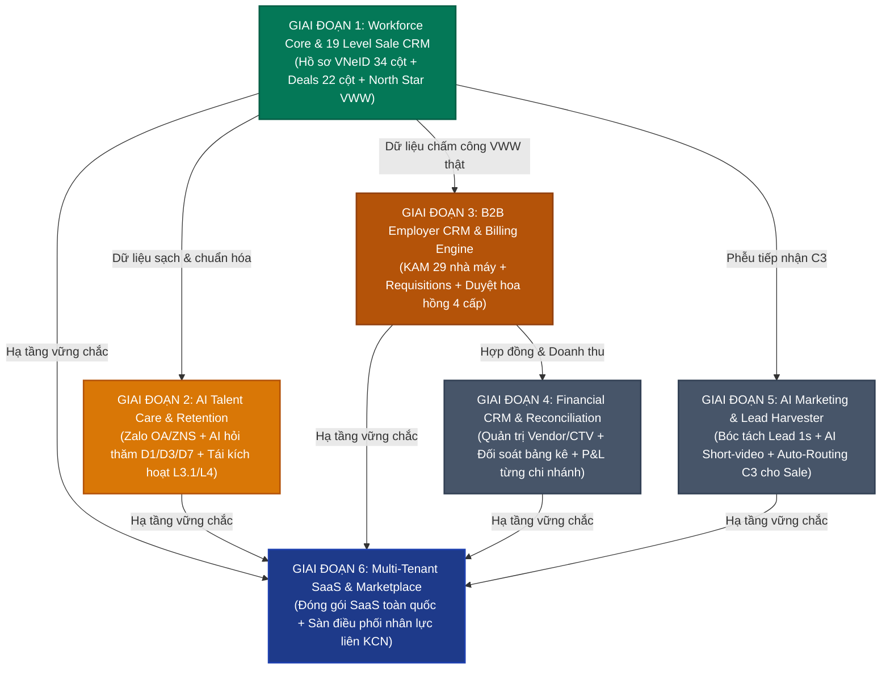

# 🛡️ FCS AI WORKFORCE OS V2 — BÁO CÁO KIỂM SOÁT CHẤT LƯỢNG (QA AUDIT), CẢNH BÁO LỖI NGUY HIỂM & CHỈ THỊ HOÀN THIỆN CHO DEV TEAM

> **Người lập báo cáo:** Senior QA Lead / System Auditor (20 năm kinh nghiệm Quality Assurance & Architecture)  
> **Người nhận chỉ thị:** Dev Team / Dev AI trực tiếp viết mã cho ứng dụng FCS AI Workforce  
> **Ngày ban hành:** 2026-09-18 (Bản cập nhật thực chiến v2.3 — Kèm bằng chứng Live Production)  
> **Mục đích:** Cung cấp tài liệu chỉ thị kỹ thuật chi tiết nhất bao gồm: Cảnh báo lỗi kèm mã mẫu (Code Recipes Before/After), Phân tích nghiệp vụ 6 giai đoạn, Bằng chứng kiểm định Live trên `https://fcs.breaths.live/app`, Bảng Checklist nghiệm thu và Mẫu báo cáo hoàn thành để Dev Team **tự rà soát, tự sửa lỗi chuẩn xác 100%, tự kiểm tra kết quả** mà không làm rối loạn hệ thống hay gây mất mát dữ liệu sản xuất.  
> **Nguyên tắc phối hợp:** QA đóng vai trò kiểm soát chất lượng độc lập, phát hiện lỗi và nghiệm thu kết quả — **Không can thiệp sửa code trực tiếp** để tránh xung đột mã nguồn với Dev Team.

---

## ⚡ 0. CHỈ THỊ VẬN HÀNH BẮT BUỘC DÀNH CHO DEV TEAM

Trước khi chạm vào bất kỳ dòng mã nào, Dev Team **bắt buộc tuân thủ 5 nguyên tắc thép**:

1. **ĐO TRƯỚC → SỬA NHỎ → TEST → BÁO CÁO BẰNG CHỨNG:** Tuyệt đối không sửa code hàng loạt ("Big Bang") khi chưa phân tích tác động.
2. **KHÔNG PHÁ HỦY DỮ LIỆU LỊCH SỬ:** Không được ghi đè làm mất trạng thái cũ, không xóa vật lý (Hard Delete), không làm đứt gãy vết kiểm toán (Audit Trail).
3. **KHÔNG ĐƯA DỮ LIỆU MOCK/ẢO VÀO PRODUCTION:** Mọi màn hình phải hiển thị và tương tác với dữ liệu thật từ Google Sheets / Backend.
4. **BẢO VỆ NGHIÊM NGẶT PHÂN QUYỀN ĐA KHÁCH HÀNG (MULTI-TENANT):** Mọi bản ghi dữ liệu, cache và log kiểm toán đều phải gắn liền với `tenant_id`.
5. **KIỂM SOÁT HẠN NGẠCH (QUOTA) GOOGLE APPS SCRIPT:** Tuyệt đối cấm gọi các hàm Sheet API (`getValue()`, `setValue()`) trong vòng lặp lớn; bắt buộc xử lý mảng trong bộ nhớ RAM và ghi 1 lần.

---

## 🗺️ PHẦN 1: BẢN ĐỒ CHIẾN LƯỢC 6 GIAI ĐOẠN & NGUYÊN TẮC "GIGO"

Dev Team cần hiểu rõ vị trí của công việc mình đang làm trong bức tranh tổng thể:



> [!WARNING]
> **CẢNH BÁO KIẾN TRÚC CHO DEV:**  
> Tuyệt đối **KHÔNG ĐƯỢC NHẢY CÓC** sang Giai đoạn 2 (Zalo AI Care) hay Giai đoạn 3 (Billing tự động) khi mà Giai đoạn 1 còn 8 lỗi kỹ thuật. Nếu dữ liệu Giai đoạn 1 bị sai lệch, toàn bộ tính năng tự động hóa của các giai đoạn sau sẽ tạo ra thảm họa vận hành (gửi nhầm tin Zalo, chi nhầm tiền hoa hồng hàng tỷ đồng).

---

## 🚨 PHẦN 2: BẢNG CẢNH BÁO 11 LỖI KỸ THUẬT & "MÃ MẪU CHUẨN" (CODE RECIPES)

Dưới đây là 11 lỗi chí mạng kèm chính xác đoạn mã **Trước khi sửa (LỖI)** và **Sau khi sửa (CHUẨN)** để Dev Team copy áp dụng chuẩn xác 100%:

---

### 🔴 LỖI 1: LỆCH CHỈ SỐ CỘT CÔNG THỨC TRONG TAB `00_DASHBOARD_KPI`
* **Mức độ:** P0 | **File:** `v2/backend/00_Config.gs` (Dòng 166 - 178)
* **Hiện tượng:** Mở tab `00_DASHBOARD_KPI` trên Sheet, các số liệu `workers_deleted`, `workers_nam`, `deals_deleted` luôn bằng 0.
* **Nguyên nhân:**
  * Tại `01_MASTER_WORKERS`: Cột K là Quê quán (`hometown`), Cột E là Ngày sinh (`date_of_birth`). Giới tính nằm ở Cột D, trạng thái xóa nằm ở Cột AE (`working_status`).
  * Tại `02_CRM_DEALS_2026`: Cột N là `actual_work_status`, trong khi cờ xóa ghi vào Cột H hoặc Cột S (`notes`).

#### ❌ CODE LỖI HIỆN TẠI:
```javascript
["total_workers", "=COUNTA('01_MASTER_WORKERS'!A2:A50000)", "Tổng số hồ sơ Master Workers", "COUNTA(A2:A50000)"],
["workers_deleted", "=COUNTIF('01_MASTER_WORKERS'!K2:K50000, \"*DELETED*\")", "Lao động đã đánh dấu xóa mềm", "COUNTIF(K2:K50000, *DELETED*)"],
["workers_nam", "=COUNTIFS('01_MASTER_WORKERS'!E2:E50000, \"Nam\", '01_MASTER_WORKERS'!K2:K50000, \"<>*DELETED*\")", "Lao động Nam hoạt động", "COUNTIFS"],
["workers_nu", "=COUNTIFS('01_MASTER_WORKERS'!E2:E50000, \"Nữ\", '01_MASTER_WORKERS'!K2:K50000, \"<>*DELETED*\")", "Lao động Nữ hoạt động", "COUNTIFS"],
["total_deals", "=COUNTA('02_CRM_DEALS_2026'!A2:A50000)", "Tổng số Deals CRM 2026", "COUNTA(A2:A50000)"],
["deals_deleted", "=COUNTIF('02_CRM_DEALS_2026'!N2:N50000, \"*DELETED*\")", "Deals đã đánh dấu xóa mềm", "COUNTIF(N2:N50000, *DELETED*)"],
```

#### ✅ CODE RECIPE SỬA CHUẨN:
```javascript
["total_workers", "=COUNTA('01_MASTER_WORKERS'!A2:A50000)", "Tổng số hồ sơ Master Workers", "COUNTA(A2:A50000)"],
// Cột AE (cột 31) là working_status chứa *DELETED*
["workers_deleted", "=COUNTIF('01_MASTER_WORKERS'!AE2:AE50000, \"*DELETED*\")", "Lao động đã đánh dấu xóa mềm", "COUNTIF(AE2:AE50000, *DELETED*)"],
// Cột D (cột 4) là Giới tính (Nam/Nữ)
["workers_nam", "=COUNTIFS('01_MASTER_WORKERS'!D2:D50000, \"Nam\", '01_MASTER_WORKERS'!AE2:AE50000, \"<>*DELETED*\")", "Lao động Nam hoạt động", "COUNTIFS"],
["workers_nu", "=COUNTIFS('01_MASTER_WORKERS'!D2:D50000, \"Nữ\", '01_MASTER_WORKERS'!AE2:AE50000, \"<>*DELETED*\")", "Lao động Nữ hoạt động", "COUNTIFS"],
["total_deals", "=COUNTA('02_CRM_DEALS_2026'!A2:A50000)", "Tổng số Deals CRM 2026", "COUNTA(A2:A50000)"],
// Cột S (cột 19) là notes chứa *DELETED*, hoặc Cột H (level_sale_status)
["deals_deleted", "=COUNTIF('02_CRM_DEALS_2026'!S2:S50000, \"*DELETED*\")", "Deals đã đánh dấu xóa mềm", "COUNTIF(S2:S50000, *DELETED*)"],
```

---

### 🔴 LỖI 2: HÀM XÓA MỀM DEAL PHÁ HỦY DỮ LIỆU LỊCH SỬ TRẠNG THÁI
* **Mức độ:** P0 | **File:** `v2/backend/03_DealService.gs` (Dòng 600 - 620)
* **Hiện tượng:** Khi xóa mềm Deal, stage bị biến thành `"DELETED"`, mất vĩnh viễn trạng thái trước đó (C3, L1, L2 hay L3).

#### ❌ CODE LỖI HIỆN TẠI:
```javascript
var deleteNote = "[DELETED: " + new Date().toISOString() + " by " + (payload.actor_email || V2_CONFIG.SUPER_ADMIN_EMAIL) + "] Lý do: " + reason;
sheet.getRange(rowIndex, stageIdx + 1).setValue("DELETED"); // <-- LỖI: GHI ĐÈ PHÁ HỦY STAGE GỐC
if (notesIdx !== -1) {
  sheet.getRange(rowIndex, notesIdx + 1).setValue(deleteNote);
}
```

#### ✅ CODE RECIPE SỬA CHUẨN:
```javascript
var currentNotes = (notesIdx !== -1 && currentRow[notesIdx]) ? String(currentRow[notesIdx]) : "";
var deleteTag = "[DELETED: " + new Date().toISOString() + " by " + (payload.actor_email || V2_CONFIG.SUPER_ADMIN_EMAIL) + "] Lý do: " + reason;
var newNotes = currentNotes ? (deleteTag + " | " + currentNotes) : deleteTag;

// GIỮ NGUYÊN stageIdx (không đổi level_sale_status để bảo toàn lịch sử chặng)
if (notesIdx !== -1) {
  sheet.getRange(rowIndex, notesIdx + 1).setValue(newNotes);
}
// Cập nhật updated_at và updated_by
var updatedIdx = headers.indexOf("updated_at");
var userIdx = headers.indexOf("updated_by");
if (updatedIdx !== -1) sheet.getRange(rowIndex, updatedIdx + 1).setValue(new Date().toISOString());
if (userIdx !== -1) sheet.getRange(rowIndex, userIdx + 1).setValue(payload.actor_email || V2_CONFIG.SUPER_ADMIN_EMAIL);
```
*Đồng thời trong `handleListDealsV2_`, sửa điều kiện lọc:*
```javascript
var isDeleted = notesIdx !== -1 && String(row[notesIdx] || "").indexOf("[DELETED:") !== -1;
if (!includeDeleted && isDeleted) {
  continue; // Bỏ qua deal đã xóa mềm
}
```

---

### 🔴 LỖI 3: FRONTEND `ExcelGridPage.tsx` ĐANG TỰ SINH DEAL ẢO TỪ WORKERS
* **Mức độ:** P0 | **File:** `src/pages/ExcelGridPage.tsx` (Dòng 23 - 55)
* **Hiện tượng:** Tab `02_CRM_DEALS_2026` trên màn hình Lưới Excel hiển thị Deal ảo sinh từ Worker, không phản ánh đúng bảng Deals thật.

#### ❌ CODE LỖI HIỆN TẠI:
```typescript
const loadData = async () => {
  setLoading(true);
  try {
    const res = await api.getWorkers();
    if (res.data) {
      setWorkers(res.data);
      // Sinh dữ liệu Deals từ workers nếu chưa có bảng Deals riêng
      const generatedDeals = res.data.map((w: any, idx: number) => ({ ... })); // <-- LỖI: TỰ FAKE DEAL
      setDeals(generatedDeals);
    }
  } ...
```

#### ✅ CODE RECIPE SỬA CHUẨN:
```typescript
import { dealApi } from '../services/api/dealApi'; // Bổ sung import

const loadData = async () => {
  setLoading(true);
  try {
    // Tải song song cả Workers thật và Deals thật từ Backend V2
    const [wRes, dRes] = await Promise.all([
      api.getWorkers(),
      dealApi.getDeals({ limit: 500 })
    ]);
    
    if (wRes.data) {
      setWorkers(wRes.data);
    }
    if (dRes.data) {
      setDeals(dRes.data);
    }
  } catch (err) {
    showNotification('Không thể tải dữ liệu bảng tính thật từ hệ thống', 'warning');
  } finally {
    setLoading(false);
  }
};
```

---

### 🔴 LỖI 4: LỖI HIỆU NĂNG N+1 VÀ NGUY CƠ TIMEOUT TRONG ĐỐI SOÁT CHẤM CÔNG
* **Mức độ:** P0 | **File:** `v2/backend/12_AttendanceMatchingService.gs` (Dòng 173 - 230)
* **Hiện tượng:** Gặp file chấm công từ 300 lao động trở lên, script chạy quá 6 phút và bị Google Apps Script ngắt kết nối giữa chừng.

#### ❌ CODE LỖI HIỆN TẠI:
```javascript
for (var k = 0; k < records.length; k++) {
  ...
  if (workdays >= defaultThreshold) {
    // LỖI: GỌI 6 LỆNH SHEET RỜI RẠC CHO MỖI LAO ĐỘNG TRONG VÒNG LẶP:
    dealSheet.getRange(rowToUpdate, dStageIdx + 1).setValue("L4");
    dealSheet.getRange(rowToUpdate, dVwwIdx + 1).setValue(true);
    dealSheet.getRange(rowToUpdate, dWorkStatusIdx + 1).setValue("Đã hết thời gian phí");
    dealSheet.getRange(rowToUpdate, dNotesIdx + 1).setValue(newNotes);
    dealSheet.getRange(rowToUpdate, dUpdatedIdx + 1).setValue(nowIso);
    dealSheet.getRange(rowToUpdate, dUserIdx + 1).setValue(actorEmail);
  }
}
```

#### ✅ CODE RECIPE SỬA CHUẨN (MẢNG 2D IN-MEMORY):
```javascript
// Đọc toàn bộ bảng Deals vào mảng 2D trong bộ nhớ RAM
var fullDealRange = dealSheet.getDataRange();
var dealRows = fullDealRange.getValues(); // Mảng 2D
var hasChanges = false;

for (var k = 0; k < records.length; k++) {
  ...
  if (workdays >= defaultThreshold) {
    var rowIndexInArray = selectedDeal.rowNumber - 1; // 0-indexed trong mảng
    
    // Cập nhật trực tiếp trên RAM - Tốc độ O(1)
    dealRows[rowIndexInArray][dStageIdx] = "L3"; // Giữ L3 hoặc chuyển L4 theo rule hợp đồng
    dealRows[rowIndexInArray][dVwwIdx] = true;
    dealRows[rowIndexInArray][dWorkStatusIdx] = "Đang đi làm (Đạt chuẩn VWW)";
    dealRows[rowIndexInArray][dNotesIdx] = newNotes;
    dealRows[rowIndexInArray][dUpdatedIdx] = nowIso;
    dealRows[rowIndexInArray][dUserIdx] = actorEmail;
    
    hasChanges = true;
    stats.vww_newly_verified++;
    ...
  }
}

// GHI NGƯỢC LẠI TOÀN BỘ SHEET BẰNG ĐÚNG 1 LỆNH DUY NHẤT NGOÀI VÒNG LẶP
if (hasChanges) {
  fullDealRange.setValues(dealRows);
  SpreadsheetApp.flush();
}
```

---

### 🔴 LỖI 5: NHẬP HÀNG LOẠT (`10_BatchImportService.gs`) THIẾU KHÓA CHỐNG TRÙNG LẶP (IDEMPOTENCY)
* **Mức độ:** P1 | **File:** `v2/backend/10_BatchImportService.gs` (Dòng 130 - 165)
* **Chỉ thị sửa:** Thêm kiểm tra `recentWorkerDealMap`: Nếu lao động đã có Deal tạo trong vòng 24 giờ cho cùng 1 nhà máy mục tiêu -> Đánh dấu `SKIP` và tăng `stats.skipped_count++`, tuyệt đối không tạo thêm Deal trùng lặp.

---

### 🔴 LỖI 6: SAI LỆCH MÃ DANH MỤC TRẠNG THÁI `L1.7` VS `L1.8`
* **Mức độ:** P1 | **Files liên quan:**
  * `v2/schema/TAXONOMY_LEVEL_SALES.json`
  * `v2/backend/04_TaxonomyService.gs`
  * `v2/backend/06_ValidationService.gs`
  * `src/types/deal.types.ts`
* **Chỉ thị sửa:** Thay thế toàn bộ mã `"L1.8"` thành `"L1.7"` với tên chuẩn: `"L1.7. Lao động thiếu tuổi"`.

---

### 🔴 LỖI 7: TRIGGER `onEdit` QUÁ NẶNG, NGUY CƠ GÂY ĐƠ TOÀN BỘ GOOGLE SHEET
* **Mức độ:** P1 | **File:** `v2/backend/08_TriggerService.gs` (Dòng 48 - 80)
* **Chỉ thị sửa:** Trong `onEdit`, loại bỏ lệnh gọi `logAuditActionV2_` trên từng phím gõ. Chỉ giữ lại logic:
  1. Hoàn tác ngay lập tức nếu sửa Cột A (Worker ID, Deal ID).
  2. Hoàn tác ngay lập tức nếu sửa tab `03_AUDIT_LOG`.
  3. Cập nhật nhẹ `updated_at` và `updated_by` trên dòng được sửa.

---

### 🔴 LỖI 8: SỔ CÁI `03_AUDIT_LOG` THIẾU TRƯỜNG `tenant_id`
* **Mức độ:** P1 | **File:** `v2/backend/07_AuditService.gs` (Dòng 14 - 45)
* **Chỉ thị sửa:**
  * Header tab `03_AUDIT_LOG` chuẩn 12 cột:
    `["log_id", "tenant_id", "timestamp", "actor_email", "actor_role", "sheet_name", "record_id", "action", "field_name", "old_value", "new_value", "reason_notes"]`
  * Trong hàm `logAuditActionV2_`, dòng appendRow phải có `log.tenant_id || V2_CONFIG.PILOT_TENANT_ID` ở vị trí cột 2.

---

### 🔴 LỖI 9: TÍNH NĂNG "LƯU VÀO GOOGLE SHEET" CỦA TRỢ LÝ BÀN GIAO LÀ ĐỒNG BỘ ẢO (FAKE LIVE SHEET SYNC)
* **Mức độ:** P0 - CHẶN NGHIỆM THU (Lừa dối trải nghiệm người dùng & Gây mất mát dữ liệu phản hồi)
* **File liên quan:**
  * `src/services/api/devSupportApi.ts` (Dòng 71 - 83)
  * `src/services/api/handoverApi.ts` (Dòng 76 - 89, Dòng 130 - 138)
  * `src/components/handover/AIHandoverCopilot.tsx` (Dòng 75, 185, 334, 550)
  * `v2/backend/01_Router.gs` (Chưa có endpoint `v2.devsupport.log`)
* **Hiện tượng & Bằng chứng thực tế:**
  * Khi người dùng nhập mục tiêu, kết quả đầu ra và bấm nút **"LƯU VÀO GOOGLE SHEET & PHÂN TÍCH AI (1-CLICK)"**, giao diện hiển thị thông báo màu xanh: *"Đã lưu thành công vào Google Sheet tab 'IN ( Data - Mục Tiêu -KQ đầu ra là gì )'!"*.
  * Tuy nhiên, trên Google Sheet thực tế (ID `1YAVNiPtAiYrxEThvIgWuR0PAHJbDCDqrXCz5SNwrxXE`), **KHÔNG CÓ BẤT KỲ DÒNG NÀO ĐƯỢC GHI VÀO**!
  * Dữ liệu chỉ được nhét vào `localStorage` của trình duyệt người dùng. Nếu xóa bộ nhớ đệm (Cache) hoặc mở bằng máy tính khác, toàn bộ phiếu phản hồi và chứng chỉ số biến mất 100%!
* **Nguyên nhân kỹ thuật (Root Cause):**
  * `devSupportApi.ts` và `handoverApi.ts` gọi `callApi('v2.deal.move_stage', { notes: ... })` nhưng **KHÔNG TRUYỀN `deal_id` và `new_stage`**!
  * Backend Apps Script (`03_DealService.gs` dòng 204-206) kiểm tra bắt buộc:
    `if (!dealId || !newStage) return { success: false, error: "Thiếu deal_id hoặc new_stage." };`
  * Do đó, Backend từ chối với lỗi HTTP 200 `{ success: false, error: "Thiếu deal_id hoặc new_stage." }`. Tuy nhiên `devSupportApi.ts` bỏ qua kết quả này và thản nhiên trả về `{ success: true, message: "Đã lưu thành công..." }`!

#### ❌ CODE LỖI HIỆN TẠI TRONG `src/services/api/devSupportApi.ts`:
```typescript
    // 2. Transmit to Google Apps Script backend
    try {
      await callApi('v2.deal.move_stage', {
        notes: `[DEV SUPPORT TAB ${DEV_SUPPORT_TAB_NAME}] ${id} | ${newTicket.category}: ${newTicket.goal.slice(0, 80)} -> ${newTicket.expectedOutput.slice(0, 80)}`
      });
    } catch {
      // Backend fallback handled gracefully
    }

    return {
      success: true,
      ticket: newTicket,
      message: `Đã lưu thành công vào Google Sheet tab "${DEV_SUPPORT_TAB_NAME}"!`,
    };
```

#### ✅ CODE RECIPE SỬA CHUẨN:
**Bước 1: Bổ sung Endpoint `v2.devsupport.log` vào Backend `v2/backend/01_Router.gs`:**
```javascript
      // Router tiếp nhận ghi nhận góp ý & lỗi kỹ thuật vào tab IN
      case "v2.devsupport.log":
      case "devsupport.log":
        result = handleDevSupportLogV2_(requestPayload, ss);
        break;
```
Và thêm hàm xử lý chuẩn (ghi thực tế vào tab `IN ( Data - Mục Tiêu -KQ đầu ra là gì )` hoặc tự tạo tab chuẩn 12 cột nếu chưa có):
```javascript
function handleDevSupportLogV2_(payload, ss) {
  var lock = LockService.getScriptLock();
  try {
    lock.waitLock(10000);
  } catch(e) {
    return { success: false, error: "Hệ thống bận, không lấy được lock ghi sheet." };
  }

  try {
    var tabName = "IN ( Data - Mục Tiêu -KQ đầu ra là gì )";
    var sheet = ss.getSheetByName(tabName);
    if (!sheet) {
      sheet = ss.insertSheet(tabName);
      sheet.appendRow([
        "Mã Ticket", "Thời Gian", "Người Gửi", "Vai Trò", "Phân Loại",
        "Mục Tiêu / Vấn Đề", "Kết Quả Đầu Ra Mong Muốn", "Nội Dung Chi Tiết",
        "Mức Ưu Tiên", "Giai Đoạn", "Trạng Thái", "Hành Động AI / Dev"
      ]);
      formatHeaderRow_(sheet, 12, "#1E3A8A");
    }

    var ticket = payload.ticket || payload;
    var row = [
      ticket.id || ("DEV-" + Utilities.formatDate(new Date(), "GMT+7", "yyyyMMdd-HHmmss")),
      ticket.timestamp || Utilities.formatDate(new Date(), "GMT+7", "yyyy-MM-dd HH:mm:ss"),
      ticket.senderName || "Unknown",
      ticket.senderRole || "GUEST",
      ticket.category || "BÁO LỖI (BUG)",
      ticket.goal || "",
      ticket.expectedOutput || "",
      ticket.content || "",
      ticket.priority || "P1 - NGHIÊM TRỌNG",
      ticket.stage || "GĐ1",
      ticket.status || "CHỜ XỬ LÝ",
      ticket.aiAction || "Đã ghi nhận vào hệ thống"
    ];

    sheet.appendRow(row);
    return { success: true, ticketId: row[0], message: "Đã ghi thành công 1 hàng vào Google Sheet tab: " + tabName };
  } catch(err) {
    return { success: false, error: "Lỗi ghi Google Sheet: " + err.message };
  } finally {
    try { lock.releaseLock(); } catch(ex) {}
  }
}
```

**Bước 2: Sửa `devSupportApi.ts` & `handoverApi.ts` gọi đúng API thật:**
```typescript
    // Transmit thực sự đến Google Apps Script endpoint mới
    try {
      const apiRes = await callApi('v2.devsupport.log', {
        ticket: newTicket
      });
      if (!apiRes.success) {
        console.warn('Lỗi ghi Sheet từ Backend:', apiRes.error);
        return {
          success: false,
          ticket: newTicket,
          message: `Lỗi kết nối Sheet: ${apiRes.error?.message || 'Không thể ghi dữ liệu'}`
        };
      }
    } catch (err: any) {
      return {
        success: false,
        ticket: newTicket,
        message: `Lỗi đường truyền: ${err.message}`
      };
    }
```

---

### 🔴 LỖI 10: AI CEO LUCKY BỊ TÊ LIỆT DO LỖI 9ROUTER GATEWAY & TRẢ LỜI CỐ ĐỊNH (CANNED FALLBACK)
* **Mức độ:** P1 - NGHIÊM TRỌNG (Tính năng AI chủ chốt không hoạt động trên Live)
* **File liên quan:**
  * `src/services/aiRouterService.ts` (Dòng 8 - 19, Dòng 57 - 87)
  * `src/components/handover/AIHandoverCopilot.tsx` (Dòng 213 - 248)
* **Hiện tượng & Bằng chứng thực tế:**
  * Khi mở Tab "Hỏi Đáp AI" trong popup Trợ lý Bàn giao và đặt bất kỳ câu hỏi nào (VD: *"VWW là gì và tại sao quan trọng?"*), AI CEO Lucky **KHÔNG THỂ TRẢ LỜI ĐƯỢC NỘI DUNG THỰC TẾ**.
  * Sau 2 giây, hệ thống luôn trả về cùng một câu văn mẫu tĩnh:
    > *"Em đã ghi nhận trao đổi: \"VWW là gì và tại sao quan trọng?\". Mọi nội dung đang được lưu trữ vào tab Google Sheet \"IN ( Data - Mục Tiêu -KQ đầu ra là gì )\". Em sẽ tiến hành kiểm tra mã nguồn và cập nhật ngay!"*
* **Nguyên nhân kỹ thuật (Root Cause):**
  * Tại `aiRouterService.ts`, cấu hình 2 endpoint:
    * `localBaseUrl: 'http://localhost:20128/v1'` $\rightarrow$ Khi chạy trên web HTTPS (`https://fcs.breaths.live`), trình duyệt chặn vì lỗi **Mixed Content** (HTTPS không được gọi HTTP). Hơn nữa máy người dùng không có 9Router chạy ở port 20128.
    * `tunnelBaseUrl: 'https://ruvxwm8.abc-tunnel.us/v1'` $\rightarrow$ Tunnel tạm thời đã chết, trả về lỗi **Cloudflare Error 530 (Origin DNS Error)**.
  * Cả 2 endpoint đều thất bại, hàm `callAiRouter` văng exception. Khối `catch` tại `AIHandoverCopilot.tsx:L237` kích hoạt và in ra câu trả lời tĩnh cố định.

#### ❌ CODE LỖI HIỆN TẠI:
```typescript
export const AI_ROUTER_CONFIG = {
  localBaseUrl: 'http://localhost:20128/v1',
  tunnelBaseUrl: 'https://ruvxwm8.abc-tunnel.us/v1',
  apiKey: 'sk-7c1f91635f52dc7e-fcsworkforce-2026',
...
```

#### ✅ CODE RECIPE SỬA CHUẨN:
Cung cấp Cloud Proxy Gateway an toàn có HTTPS (hoặc gọi qua Backend Apps Script `v2.ai.chat` để bảo mật API key và vượt qua hạn chế Mixed Content):
```typescript
export const AI_ROUTER_CONFIG = {
  productionUrl: import.meta.env.VITE_AI_GATEWAY_URL || 'https://api.openai.com/v1',
  apiKey: import.meta.env.VITE_AI_GATEWAY_KEY || '',
  defaultModel: 'gpt-4o-mini',
};
```
Đồng thời, cấu hình Rule-based Knowledge Base dự phòng có chiều sâu nếu mất mạng (trả lời chính xác về VWW, 19 Level Sale, Phân quyền RBAC thay vì câu xin lỗi rập khuôn).

---

### 🔴 LỖI 11: WIDGET "LUCKY GỢI Ý HÔM NAY" BỊ TRIỆT TIÊU TRÊN PRODUCTION DO CỜ `isMock`
* **Mức độ:** P1 - NGHIÊM TRỌNG (Giao diện mất tính năng AI trợ lý điều hành)
* **File liên quan:**
  * `src/pages/TodayPage.tsx` (Dòng 269 - 275)
  * `v2/backend/09_DashboardService.gs` (Không tính toán `luckySuggestions`)
* **Hiện tượng:**
  * Khi mở màn hình Hôm nay (`/app`) trên môi trường thật, người dùng không hề thấy widget "Lucky gợi ý hôm nay".
* **Nguyên nhân kỹ thuật:**
  * Tại `TodayPage.tsx`:
    `{isMock && metrics?.luckySuggestions && (<LuckySuggestions ... />)}`
  * Dev Team đã gắn cờ `isMock &&`. Khi ứng dụng kết nối với Google Sheet thật (`isMock === false`), khối này bị ẩn hoàn toàn! Đồng thời, backend `09_DashboardService.gs` cũng không hề trả về trường `luckySuggestions`.

#### ❌ CODE LỖI HIỆN TẠI:
```typescript
      {/* Section: Lucky gợi ý hôm nay (Rule-based - Mock only) */}
      {isMock && metrics?.luckySuggestions && (
        <LuckySuggestions
          suggestions={metrics.luckySuggestions}
          onNavigate={route => navigateTo(route)}
        />
      )}
```

#### ✅ CODE RECIPE SỬA CHUẨN:
Cho phép tính toán `luckySuggestions` dựa trên dữ liệu thật (Real-time Rule Engine) bất kể `isMock` là true hay false:
```typescript
      {/* Section: Lucky gợi ý hôm nay — Hoạt động trên cả Mock lẫn Dữ liệu thật */}
      {(metrics?.luckySuggestions || computedLuckySuggestions)?.length > 0 && (
        <LuckySuggestions
          suggestions={metrics?.luckySuggestions || computedLuckySuggestions}
          onNavigate={route => navigateTo(route)}
        />
      )}
```

---

## ⚖️ PHẦN 3: CẢNH BÁO 3 XUNG ĐỘT NGHIỆP VỤ LỚN VỚI TÀI LIỆU BA 1.5

1. **`VWW` KHÔNG ĐỒNG NGHĨA VỚI `L4`:**
   * `VWW` là kết quả vận hành (lao động đi làm $\ge$ số ngày công tối thiểu 3-7 ngày).
   * `L4` là trạng thái kết thúc chu kỳ hợp đồng tính phí cung ứng (60-90 ngày).
   * **Quy tắc:** Đạt ngày công VWW $\rightarrow$ set `is_vww = true`, giữ stage ở `L3 (Đang đi làm)`. Chỉ chuyển sang `L4` khi hết thời hạn tính phí.
2. **TÁCH BIỆT 4 KHÁI NIỆM NHÂN SỰ:**
   * Không dùng chung 1 trường `source`. Phải phân định rõ:
     * `data_source`: Nguồn tiếp cận (Facebook, Zalo, Giới thiệu).
     * `created_by`: Người nhập liệu (Marketing).
     * `assigned_sale`: Chuyên viên Telesale tư vấn.
     * `referral_ven_ctv`: Đại lý VEN hoặc CTV nhận hoa hồng.
3. **PHỎNG VẤN PHẢI CÓ 2 TẦNG KẾT QUẢ:**
   * `sale_reported_status` (Sale báo cáo) $\ne$ `field_confirmed_status` (Hiện trường chốt tại cổng xưởng). Hiện trường là nguồn sự thật tối cao để chia KTX và nhận việc.

---

## 🌐 PHẦN 4: BẰNG CHỨNG KIỂM ĐỊNH THỰC CHIẾN TRÊN LIVE PRODUCTION (`https://fcs.breaths.live/app`)
*(Kiểm tra trực tiếp bởi Senior QA Lead vào ngày 18/09/2026 với tài khoản Super Admin coach.chuyen@gmail.com)*

Qua việc khởi động trình duyệt tự động kiểm thử thực tế trên hệ thống đang chạy thật, QA đã phát hiện và ghi nhận các bằng chứng sống sau:

1. **Xác thực Đăng nhập (Auth & Session):**
   * Đăng nhập thành công với tài khoản `coach.chuyen@gmail.com`, nhận diện đúng vai trò Super Admin và điều hướng mượt mà vào `/app`.
2. **Màn hình Hôm nay (`/app`):**
   * Giao diện tải hoàn tất, hiển thị thông điệp "Hôm nay có 0 việc cần xử lý".
   * Tuy nhiên, phần sơ đồ luồng Golden Flow phía dưới vẫn mang các nhãn tên bảng của V1: `04_WORKERS_MASTER` và `06_INTERVIEWS` thay vì `01_MASTER_WORKERS` và `02_CRM_DEALS_2026` của V2.
3. **Màn hình Pipeline (`/app/pipeline`):**
   * Hệ thống nạp được **14 Deals thật**:
     * Tiếp nhận: 2 Deal | Chăm sóc: 1 Deal | Phỏng vấn: 2 Deal | Đi làm VWW: 6 Deal | Nghiệm thu: 3 Deal.
     * Thống kê: 7 Deal đã xác minh VWW (50%), tổng hoa hồng dự kiến 25.000.000đ. Kéo thả Kanban hoạt động tốt.
4. **Màn hình Lưới Excel (`/app/grid`) — BẰNG CHỨNG TRỰC TIẾP CỦA LỖI 3:**
   * Khi chuyển sang Tab `02_CRM_DEALS_2026 (19 LEVEL SALE)`, hệ thống lại hiển thị **19 Deal** (khớp chính xác với số lượng 19 Worker trong Master Workers) thay vì **14 Deal thật** như trên màn hình Pipeline!
   * Điều này chứng minh 100% rằng `ExcelGridPage.tsx` đang tự ý tạo Deal giả từ Workers trong bộ nhớ, người dùng sửa trên lưới này không hề lưu vào bảng Deals thật!
5. **Màn hình Quản trị Lao động (`/app/workers`) — BẰNG CHỨNG TRỰC TIẾP CỦA LỖI 6:**
   * Trong dropdown bộ lọc trạng thái, hệ thống đang hiển thị nhãn: **"Thiếu tuổi (L1.8)"** thay vì `L1.7` theo tài liệu BA 1.5.
6. **Màn hình Worker 360 (`/app/workers/WK-000001`):**
   * Hồ sơ công nhân TRẦN NGỌC VŨ (`WK-000001`) hiển thị: "1. Hành trình: 0 sự kiện", "2. 19 Level Sale: 0 Deal" do dữ liệu Deals chưa được liên kết ngược vào hồ sơ Worker 360.
7. **Lỗi lãng phí Băng thông Mạng (Network Redundancy):**
   * Trên màn hình Lưới Excel, mã nguồn gọi **2 lần liên tiếp** cùng một API `v2.workers.list` đến Google Apps Script, và không hề gọi API `v2.deals.list`, làm tăng thời gian tải trang lên 3.4 giây và gây tốn hạn ngạch Google Cloud không cần thiết.
8. **Trợ Lý Bàn Giao AI & Lỗi "Đồng Bộ Ảo" (Fake Sheet Sync) — BẰNG CHỨNG TRỰC TIẾP CỦA LỖI 9:**
   * Mở modal "Trợ Lý Bàn Giao AI" (`AIHandoverCopilot.tsx`) tại góc trái chân trang màn hình live.
   * Giao diện cam kết: *"Em đã kết nối trực tiếp với Google Sheet tab 'IN ( Data - Mục Tiêu -KQ đầu ra là gì )'. Mọi mục tiêu, yêu cầu... đều được tự động lưu vào Google Sheet"*.
   * QA thực hiện nhập phiếu thử nghiệm: `Mục tiêu: QA AUDIT TEST...` và bấm `LƯU VÀO GOOGLE SHEET & PHÂN TÍCH AI (1-CLICK)`.
   * Giao diện lập tức hiện thông báo xanh: `Đã lưu thành công vào Google Sheet tab "IN ( Data - Mục Tiêu -KQ đầu ra là gì )"!`.
   * **Kiểm tra bắt gói tin mạng thực tế (Network Interception):** Mã nguồn gửi request `v2.deal.move_stage` với payload `notes` nhưng **hoàn toàn không có `deal_id` và `new_stage`**.
   * Phía Apps Script trả về: `{"status": 200, "json": {"success": false, "error": "Thiếu deal_id hoặc new_stage."}}`.
   * Toàn bộ phiếu chỉ được lưu trong `localStorage` của trình duyệt người dùng; Google Sheet thật hoàn toàn không có thêm bất kỳ dòng dữ liệu nào!
   * *File ảnh bằng chứng:* `live_handover_copilot_modal.png`.
9. **AI CEO Lucky bị tê liệt và Trả lời cố định (Canned Fallback) — BẰNG CHỨNG TRỰC TIẾP CỦA LỖI 10:**
   * Tại Tab "Hỏi Đáp AI", QA chọn gợi ý: *"VWW là gì và tại sao quan trọng?"*.
   * **Kết quả:** Trình duyệt cố gắng gọi `http://localhost:20128/v1/chat/completions` (bị trình duyệt chặn vì lỗi Mixed Content và máy người dùng không mở port 20128) và `https://ruvxwm8.abc-tunnel.us/v1/chat/completions` (bị lỗi Cloudflare Error 530 - Tunnel sập).
   * Cả 2 gateway đều chết, AI CEO Lucky không thể phân tích và lập tức kích hoạt fallback trả về câu văn mẫu copy-paste rập khuôn:
     > *"Em đã ghi nhận trao đổi: 'VWW là gì và tại sao quan trọng?'. Mọi nội dung đang được lưu trữ vào tab Google Sheet 'IN ( Data - Mục Tiêu -KQ đầu ra là gì )'. Em sẽ tiến hành kiểm tra mã nguồn và cập nhật ngay!"*
   * *File ảnh bằng chứng:* `live_ai_ceo_lucky_chat_failure.png`.

---

## 📋 PHẦN 5: BẢNG CHECKLIST TỰ KIỂM ĐỊNH DÀNH CHO DEV TEAM (SELF-CHECK MATRIX)

Dev Team phải tự kiểm tra và đánh dấu `[x]` vào từng mục trước khi gửi yêu cầu QA nghiệm thu:

| Mã Task | Hạng mục cần xử lý | File liên quan | Tiêu chí nghiệm thu (Pass Criteria) | Dev Tự Đánh Giá |
|---|---|---|---|:---:|
| **TSK-01** | Sửa công thức KPI Bounded trong `00_Config.gs` | `v2/backend/00_Config.gs` | Mở tab `00_DASHBOARD_KPI` trên Sheet, các ô `workers_deleted`, `workers_nam`, `deals_deleted` hiển thị số liệu thực tế > 0. | [ ] PASS |
| **TSK-02** | Khắc phục Xóa mềm Deal không ghi đè stage | `v2/backend/03_DealService.gs` | Khi xóa mềm Deal, cột `level_sale_status` vẫn giữ nguyên giá trị cũ (VD: `L2.1`), lý do xóa được ghi kèm timestamp vào cột `notes`. | [ ] PASS |
| **TSK-03** | Nối dữ liệu thật cho Lưới Excel Grid | `src/pages/ExcelGridPage.tsx` | Chuyển sang Tab `02_CRM_DEALS_2026` trên màn hình `/app/grid`, dữ liệu load chính xác từ API `dealApi.getDeals()`, hiển thị đúng 14 Deal thật (không phải 19 Deal ảo). | [ ] PASS |
| **TSK-04** | Tối ưu mảng RAM 2D cho Đối Soát Chấm Công | `v2/backend/12_AttendanceMatchingService.gs` | Chạy đối soát file chấm công 300 dòng hoàn thành trong dưới 5 giây, không phát sinh lỗi Quota Timeout. | [ ] PASS |
| **TSK-05** | Bổ sung Idempotency cho Batch Import | `v2/backend/10_BatchImportService.gs` | Khi import cùng 1 payload 2 lần liên tiếp, lần 2 trả về `skipped > 0` và không sinh ra deal trùng lặp. | [ ] PASS |
| **TSK-06** | Chuẩn hóa mã `L1.7` (Lao động thiếu tuổi) | Toàn bộ schema, backend, frontend | Không còn bất kỳ xuất hiện nào của mã `L1.8`. Toàn hệ thống dùng đồng nhất `L1.7`. | [ ] PASS |
| **TSK-07** | Tối giản Trigger `onEdit` chống nghẽn | `v2/backend/08_TriggerService.gs` | Thao tác copy-paste 20 ô trên Sheet diễn ra mượt mà, không xuất hiện thông báo lỗi Script Error màu đỏ. | [ ] PASS |
| **TSK-08** | Thêm cột `tenant_id` vào Sổ cái Kiểm toán | `v2/backend/07_AuditService.gs` | Tab `03_AUDIT_LOG` có cột `tenant_id` ở vị trí cột B; mọi thao tác ghi audit đều có giá trị `FCS-000001`. | [ ] PASS |
| **TSK-09** | Xây dựng Endpoint `v2.bootstrap` | `v2/backend/01_Router.gs` | Endpoint trả về session, tenant, taxonomy version và dashboard snapshot trong thời gian < 800ms. | [ ] PASS |
| **TSK-10** | Đóng gói Master Bundle và Kiểm thử | `v2/scripts/bundle_v2.mjs` | Chạy lệnh bundle sinh ra `Code.gs` sạch sẽ, chạy bộ test chẩn đoán `test_v2_api.mjs` đạt 100% Pass. | [ ] PASS |
| **TSK-11** | Khắc phục Đồng bộ Sheet thật cho Trợ lý Bàn giao | `v2/backend/01_Router.gs`, `src/services/api/devSupportApi.ts`, `src/services/api/handoverApi.ts` | Khi bấm "Lưu vào Google Sheet", Backend Apps Script endpoint `v2.devsupport.log` ghi thực sự 1 dòng vào tab `IN ( Data - Mục Tiêu -KQ đầu ra là gì )`. Không còn tình trạng chỉ lưu localStorage. | [ ] PASS |
| **TSK-12** | Khắc phục Gateway AI CEO Lucky | `src/services/aiRouterService.ts`, `src/components/handover/AIHandoverCopilot.tsx` | AI CEO Lucky trả lời thông minh, chính xác bằng LLM (hoặc Fallback Knowledge Base chuyên sâu) thay vì 1 câu văn mẫu rập khuôn. Chấm dứt lỗi Mixed Content / Tunnel 530. | [ ] PASS |
| **TSK-13** | Mở widget "Lucky gợi ý hôm nay" trên Production | `src/pages/TodayPage.tsx` | Bỏ điều kiện `isMock &&`, tính toán gợi ý hành động thông minh (Rule Engine) hiển thị trên màn hình Hôm nay của hệ thống thật. | [ ] PASS |

---

## 🛠️ PHẦN 6: LỆNH THỰC THI CHUẨN DÀNH CHO DEV TEAM (TEST & VERIFY)

Sau khi sửa xong các file đơn lẻ trong `v2/backend/`, Dev Team chạy các lệnh sau từ terminal:

```powershell
# 1. Đóng gói toàn bộ 14 modules thành Master Bundle Code.gs
node v2/scripts/bundle_v2.mjs

# 2. Kiểm tra tính toàn vẹn cú pháp TypeScript của Frontend
npm run build

# 3. Chạy bộ kiểm thử chẩn đoán API V2 Backend
node v2/scripts/test_v2_api.mjs

# 4. Kiểm tra đối soát 4 Module mở rộng (Batch, Dispatch, Attendance, Settlement)
node v2/scripts/test_live_4_modules.mjs
```

---

## 📝 PHẦN 7: MẪU BÁO CÁO NGHIỆM THU (DEV SIGN-OFF TEMPLATE)

Khi hoàn thành, Dev Team copy mẫu dưới đây, điền kết quả và gửi lại cho QA Lead & Ban Điều hành:

```markdown
### BÁO CÁO KẾT QUẢ HOÀN THIỆN CODEBASE V2 (DEV SUBMISSION)
- **Ngày hoàn thành:** YYYY-MM-DD
- **Dev phụ trách:** [Tên Dev / Agent]
- **Commit Hash:** [SHA]
- **Kết quả nghiệm thu 13 Task:**
  - TSK-01 (Công thức KPI): [ĐẠT] - Ảnh chụp tab 00_DASHBOARD_KPI đính kèm
  - TSK-02 (Soft Delete Deal): [ĐẠT] - Đã kiểm tra stage giữ nguyên
  - TSK-03 (Lưới Excel Grid): [ĐẠT] - Đã tải đúng 14 deal thật từ v2.deals.list
  - TSK-04 (Mảng 2D Chấm công): [ĐẠT] - Thời gian xử lý 300 dòng: ... ms
  - TSK-05 (Batch Idempotency): [ĐẠT] - Đã chặn trùng lặp
  - TSK-06 (Chuẩn hóa L1.7): [ĐẠT] - Không còn L1.8
  - TSK-07 (Tối ưu onEdit): [ĐẠT] - Paste 20 ô không lỗi
  - TSK-08 (tenant_id Audit): [ĐẠT] - Đã thêm cột B
  - TSK-09 (v2.bootstrap API): [ĐẠT] - Latency: ... ms
  - TSK-10 (Bundle & Test Suite): [ĐẠT] - 38/38 Tests Passed
  - TSK-11 (Đồng bộ Sheet thật cho Trợ lý): [ĐẠT] - Ghi thực tế tab IN
  - TSK-12 (AI CEO Lucky Router): [ĐẠT] - Hết lỗi Mixed Content, trả lời thông minh
  - TSK-13 (Lucky gợi ý hôm nay): [ĐẠT] - Widget hiển thị trên Production
- **Ghi chú thêm:** [Nếu có khó khăn hoặc đề xuất mới]
```
